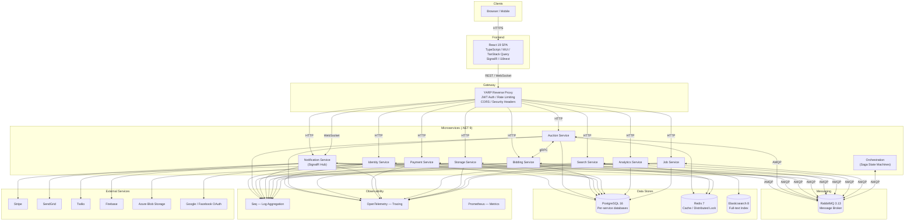
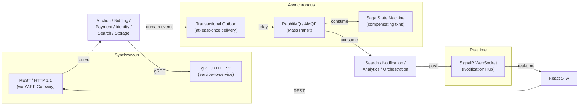
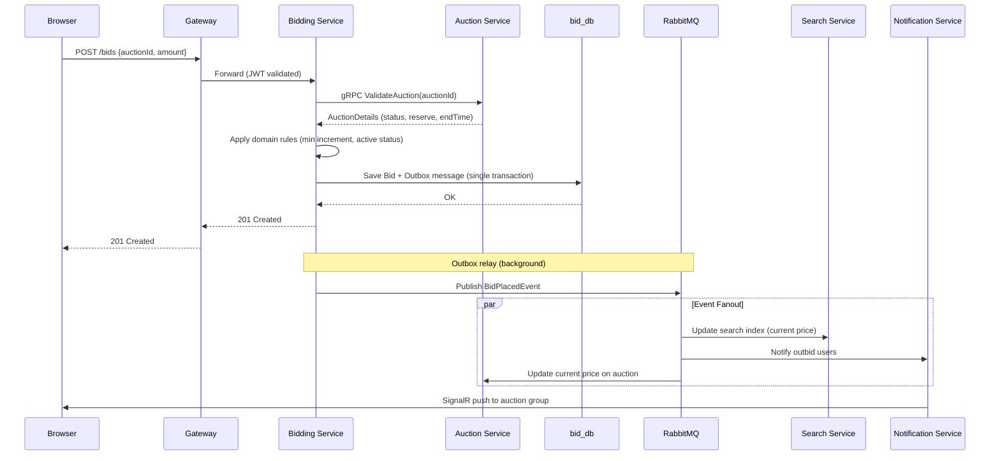
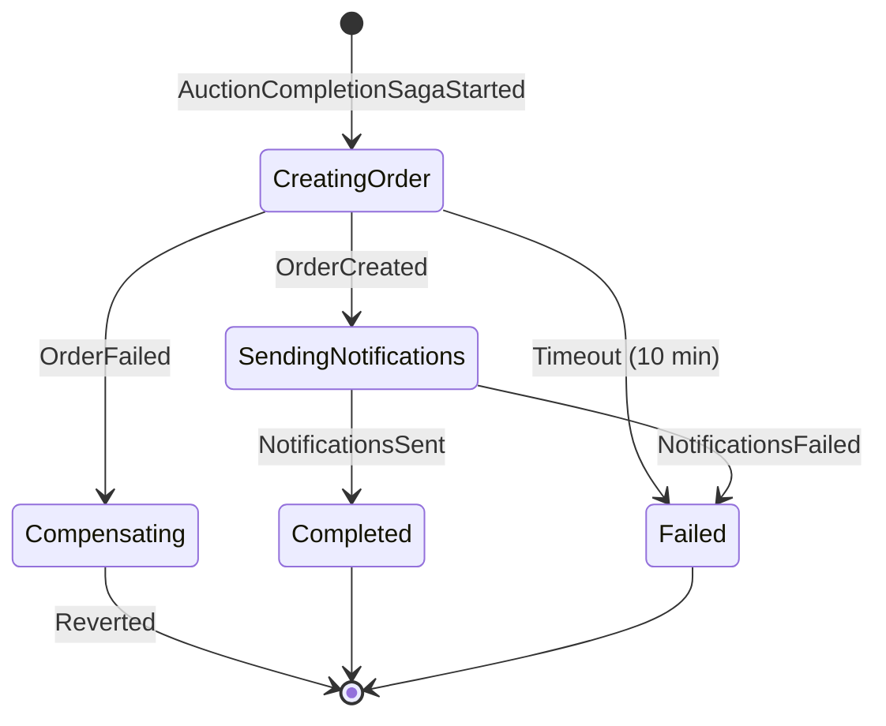
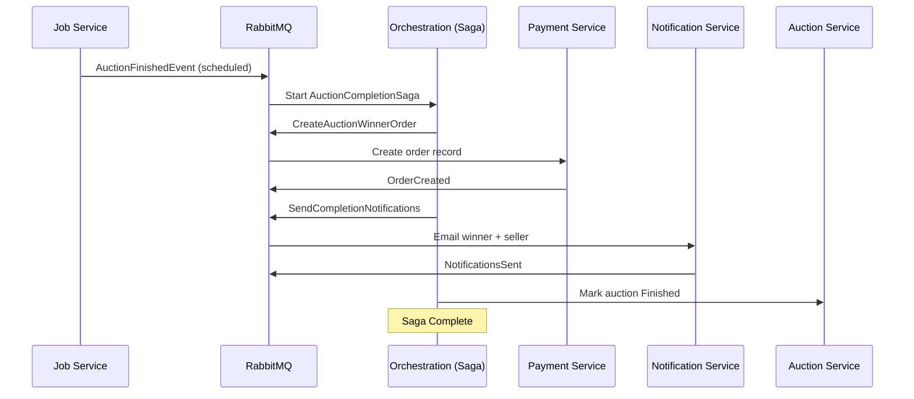
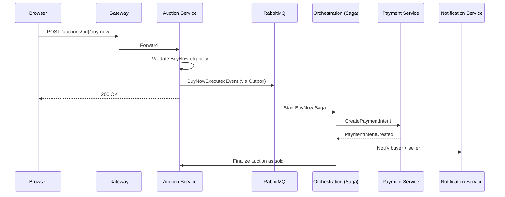
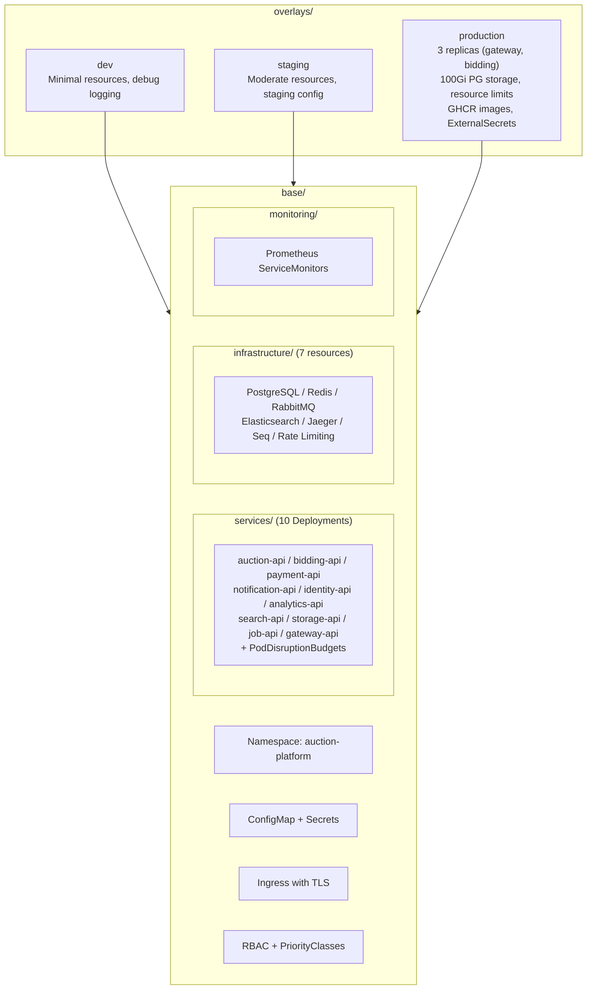
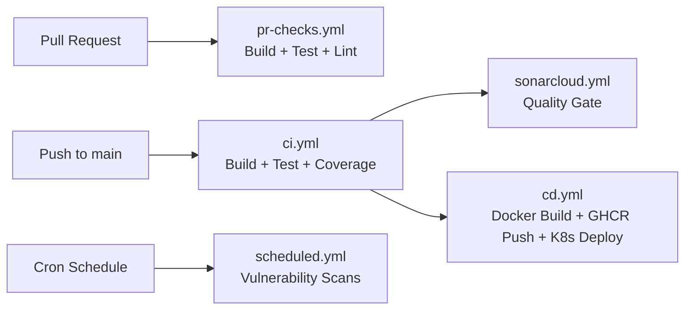
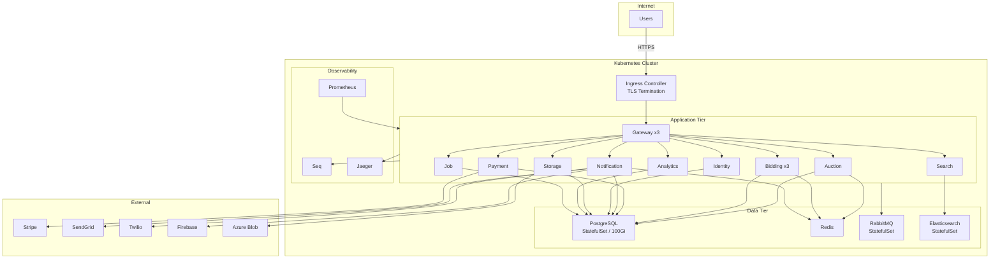

# Auction Platform — Microservices

A production-grade, event-driven auction platform built with **.NET 9 microservices** and a **React 19 frontend**.
The system supports real-time bidding, automated auction lifecycle sagas, buy-now flows, integrated payments, multi-channel notifications, full-text search, file storage, analytics, and scheduled jobs — all behind a unified API gateway.

[](https://github.com/blanho/auction-platform-microservices/actions/workflows/ci.yml)
[](https://github.com/blanho/auction-platform-microservices/actions/workflows/cd.yml)
[](https://sonarcloud.io/summary/overall?id=auction-platform-microservices)

---

## Table of Contents

- [Architecture Overview](#architecture-overview)
- [System Architecture Diagram](#system-architecture-diagram)
- [Service Map](#service-map)
- [Tech Stack](#tech-stack)
- [Communication Patterns](#communication-patterns)
- [Key Workflows](#key-workflows)
  - [Place a Bid](#1-place-a-bid)
  - [Auction Completion Saga](#2-auction-completion-saga)
  - [Buy-Now Flow](#3-buy-now-flow)
- [Project Structure](#project-structure)
- [Getting Started](#getting-started)
- [Environment Variables](#environment-variables)
- [API Gateway Routes](#api-gateway-routes)
- [Cloud and Deployment](#cloud-and-deployment)
- [Observability](#observability)
- [Testing](#testing)
- [Code Quality](#code-quality)
- [Documentation](#documentation)

---

## Architecture Overview

The platform follows a **domain-driven microservices** architecture with strict bounded contexts. Each service owns its data, communicates asynchronously through RabbitMQ (via MassTransit), and exposes REST endpoints through a centralized YARP API gateway. Multi-step business transactions are coordinated by saga state machines. The React frontend connects via REST and receives real-time updates through SignalR WebSockets.

**Core architectural patterns:**

| Pattern | Implementation |
|---|---|
| Domain-Driven Design | Bounded contexts per service, aggregates, value objects, domain events |
| CQRS | Separate command/query models via MediatR |
| Event Sourcing | Domain events as source of truth (where applicable) |
| Saga Orchestration | MassTransit state machines with compensating actions |
| Transactional Outbox | Guaranteed message delivery via EF Core outbox |
| API Gateway | YARP reverse proxy with JWT validation and rate limiting |

---

## System Architecture Diagram

> Diagrams are written in **Mermaid** and render natively on GitHub.
> To edit visually, paste any block into [Mermaid Live](https://mermaid.live).


```mermaid
graph TB
    subgraph Clients
        Browser["Browser / Mobile"]
    end

    subgraph Frontend
        SPA["React 19 SPA<br/>TypeScript / MUI / TanStack Query<br/>SignalR / i18next"]
    end

    subgraph Gateway
        GW["YARP Reverse Proxy<br/>JWT Auth / Rate Limiting<br/>CORS / Security Headers"]
    end

    subgraph Services["Microservices (.NET 9)"]
        direction TB
        IDN["Identity Service"]
        AUC["Auction Service"]
        BID["Bidding Service"]
        PAY["Payment Service"]
        NOT["Notification Service<br/>(SignalR Hub)"]
        SRC["Search Service"]
        STR["Storage Service"]
        ANA["Analytics Service"]
        JOB["Job Service"]
        ORC["Orchestration<br/>(Saga State Machines)"]
    end

    subgraph Data["Data Stores"]
        PG[("PostgreSQL 16<br/>Per-service databases")]
        RD[("Redis 7<br/>Cache / Distributed Lock")]
        ES[("Elasticsearch 8<br/>Full-text Index")]
    end

    subgraph Messaging
        RMQ[("RabbitMQ 3.13<br/>Message Broker")]
    end

    subgraph Observability
        SEQ["Seq — Log Aggregation"]
        OTEL["OpenTelemetry — Tracing"]
        PROM["Prometheus — Metrics"]
    end

    subgraph External["External Services"]
        STRIPE["Stripe"]
        SENDGRID["SendGrid"]
        TWILIO["Twilio"]
        FIREBASE["Firebase"]
        AZURE["Azure Blob Storage"]
        OAUTH["Google / Facebook OAuth"]
    end

    Browser -->|HTTPS| SPA
    SPA -->|REST / WebSocket| GW
    GW -->|HTTP| IDN & AUC & BID & PAY & NOT & SRC & STR & ANA & JOB
    GW -->|WebSocket| NOT

    AUC <-->|gRPC| BID
    IDN & AUC & BID & PAY & NOT & SRC & STR & ANA & JOB & ORC <-->|AMQP| RMQ

    IDN & AUC & BID & PAY & NOT & STR & ANA & JOB --> PG
    AUC & BID & NOT --> RD
    SRC --> ES

    PAY --> STRIPE
    NOT --> SENDGRID & TWILIO & FIREBASE
    STR --> AZURE
    IDN --> OAUTH

    IDN & AUC & BID & PAY & NOT & SRC & STR & ANA & JOB --> SEQ
    IDN & AUC & BID & PAY & NOT & SRC & STR & ANA & JOB --> OTEL
```

---

## Service Map

| Service | Port | gRPC | Database | Responsibilities |
|---|---|---|---|---|
| **Identity** | 5001 | — | `identity_db` | JWT issuance, OAuth (Google / Facebook), user management |
| **Auction** | 5002 | 5011 | `auction_db` | Auction CRUD, categories, brands, bookmarks, reviews, media |
| **Bidding** | 5003 | 5012 | `bid_db` | Place bids, auto-bids, bid history, retract bid |
| **Payment** | 5004 | — | `payment_db` | Stripe integration, wallets, order processing, refunds |
| **Notification** | 5005 | — | `notification_db` | Email (SendGrid), SMS (Twilio), Push (Firebase), SignalR hub |
| **Job** | 5006 | — | `job_db` | Scheduled background tasks (auction lifecycle, cleanup) |
| **Analytics** | 5007 | — | `analytics_db` | Event ingestion, reporting, dashboards |
| **Search** | 5008 | — | Elasticsearch | Full-text auction search, filtering, facets |
| **Storage** | 5009 | — | `storage_db` | File upload, validation, Azure Blob / local storage |
| **Gateway** | 6001 | — | — | YARP reverse proxy, JWT validation, rate limiting |
| **Orchestration** | — | — | RMQ state | MassTransit sagas: AuctionCompletion, BuyNow |

---

## Tech Stack

### Backend

| Category | Technology |
|---|---|
| Runtime | .NET 9, C# |
| Architecture | Clean Architecture (Domain / Application / Infrastructure / API) |
| API | ASP.NET Core Minimal API + Carter |
| CQRS / Mediator | MediatR |
| ORM | Entity Framework Core 9 |
| Messaging | MassTransit + RabbitMQ |
| Transactional Outbox | MassTransit Outbox (EF Core) |
| Saga Orchestration | MassTransit StateMachine |
| gRPC | Grpc.AspNetCore / Grpc.Net.Client |
| API Gateway | YARP (Yet Another Reverse Proxy) |
| Auth | Custom JWT (HS256 / RS256), OAuth2 (Google, Facebook) |
| Caching | Redis (StackExchange.Redis) |
| Distributed Lock | Redis (Redlock pattern) |
| Search | Elasticsearch 8 (Elastic.Clients.Elasticsearch) |
| Logging | Serilog → Seq / Elasticsearch |
| Tracing | OpenTelemetry → Jaeger (OTLP) |
| Validation | FluentValidation |
| Resilience | Polly (circuit breaker, retry, timeout, bulkhead) |
| Scheduling | Hangfire / Quartz (Job Service) |
| Payment | Stripe .NET SDK |
| Email / SMS / Push | SendGrid, Twilio, Firebase Admin SDK |
| File Storage | Azure Blob Storage / Local |
| Testing | xUnit, NSubstitute, FluentAssertions |

### Frontend

| Category | Technology |
|---|---|
| Framework | React 19 |
| Language | TypeScript 5.9 |
| Build Tool | Vite 7 |
| UI Library | MUI (Material UI) v7 |
| Animations | Framer Motion 12 |
| Styling | Tailwind CSS 4 |
| State / Data Fetching | TanStack Query v5 |
| Routing | React Router v7 |
| Forms | React Hook Form + Zod |
| Real-time | @microsoft/signalr v10 |
| Charts | Recharts 3 |
| i18n | i18next + react-i18next |
| HTTP Client | Axios |
| Linting / Formatting | ESLint 9, Prettier 3, Husky + lint-staged |

---

## Communication Patterns


```mermaid
graph LR
    subgraph Synchronous
        REST["REST / HTTP 1.1<br/>(via YARP Gateway)"]
        GRPC["gRPC / HTTP 2<br/>(service-to-service)"]
    end

    subgraph Asynchronous
        OUTBOX["Transactional Outbox<br/>(at-least-once delivery)"]
        AMQP["RabbitMQ / AMQP<br/>(MassTransit)"]
        SAGA["Saga State Machine<br/>(compensating txns)"]
    end

    subgraph Realtime
        WS["SignalR WebSocket<br/>(Notification Hub)"]
    end

    Frontend["React SPA"] --REST--> REST
    REST --routed--> Backends["Auction / Bidding /<br/>Payment / Identity /<br/>Search / Storage"]
    Backends --gRPC--> GRPC
    Backends --domain events--> OUTBOX
    OUTBOX --relay--> AMQP
    AMQP --consume--> SAGA
    AMQP --consume--> Subscribers["Search / Notification /<br/>Analytics / Orchestration"]
    Subscribers --push--> WS
    WS --real-time--> Frontend
```

| Pattern | Where Used | Purpose |
|---|---|---|
| REST (HTTP/1.1) | Frontend → Gateway → Services | Standard CRUD operations and queries |
| gRPC (HTTP/2) | Auction ↔ Bidding | Low-latency cross-service queries (validate auction before bid) |
| MassTransit + RabbitMQ | All services | Async domain events, integration events, commands |
| Transactional Outbox | Auction, Bidding, Payment | Guarantee message delivery after DB commit |
| Saga (StateMachine) | Orchestration service | Multi-step transactions with compensating actions |
| SignalR | Notification → Browser | Real-time bid updates, auction status, notifications |
| CQRS | All domain services | Separate read/write models via MediatR |

---

## Key Workflows

### 1. Place a Bid


```mermaid
sequenceDiagram
    participant B as Browser
    participant GW as Gateway
    participant BID as Bidding Service
    participant AUC as Auction Service
    participant DB as bid_db
    participant MQ as RabbitMQ
    participant SRC as Search Service
    participant NOT as Notification Service

    B->>GW: POST /bids {auctionId, amount}
    GW->>BID: Forward (JWT validated)
    BID->>AUC: gRPC ValidateAuction(auctionId)
    AUC-->>BID: AuctionDetails (status, reserve, endTime)
    BID->>BID: Apply domain rules (min increment, active status)
    BID->>DB: Save Bid + Outbox message (single transaction)
    DB-->>BID: OK
    BID-->>GW: 201 Created
    GW-->>B: 201 Created

    Note over BID,MQ: Outbox relay (background)
    BID->>MQ: Publish BidPlacedEvent

    par Event Fanout
        MQ->>SRC: Update search index (current price)
        MQ->>NOT: Notify outbid users
        MQ->>AUC: Update current price on auction
    end

    NOT->>B: SignalR push to auction group
```

### 2. Auction Completion Saga


```mermaid
stateDiagram-v2
    [*] --> CreatingOrder : AuctionCompletionSagaStarted
    CreatingOrder --> SendingNotifications : OrderCreated
    CreatingOrder --> Compensating : OrderFailed
    CreatingOrder --> Failed : Timeout (10 min)
    SendingNotifications --> Completed : NotificationsSent
    SendingNotifications --> Failed : NotificationsFailed
    Compensating --> [*] : Reverted
    Completed --> [*]
    Failed --> [*]
```


```mermaid
sequenceDiagram
    participant JOB as Job Service
    participant MQ as RabbitMQ
    participant ORC as Orchestration (Saga)
    participant PAY as Payment Service
    participant NOT as Notification Service
    participant AUC as Auction Service

    JOB->>MQ: AuctionFinishedEvent (scheduled)
    MQ->>ORC: Start AuctionCompletionSaga
    ORC->>MQ: CreateAuctionWinnerOrder
    MQ->>PAY: Create order record
    PAY->>MQ: OrderCreated

    ORC->>MQ: SendCompletionNotifications
    MQ->>NOT: Email winner + seller
    NOT->>MQ: NotificationsSent

    ORC->>AUC: Mark auction Finished
    Note over ORC: Saga Complete
```

### 3. Buy-Now Flow


```mermaid
sequenceDiagram
    participant B as Browser
    participant GW as Gateway
    participant AUC as Auction Service
    participant MQ as RabbitMQ
    participant ORC as Orchestration (Saga)
    participant PAY as Payment Service
    participant NOT as Notification Service

    B->>GW: POST /auctions/{id}/buy-now
    GW->>AUC: Forward
    AUC->>AUC: Validate BuyNow eligibility
    AUC->>MQ: BuyNowExecutedEvent (via Outbox)
    AUC-->>B: 200 OK

    MQ->>ORC: Start BuyNow Saga
    ORC->>PAY: CreatePaymentIntent
    PAY-->>ORC: PaymentIntentCreated
    ORC->>NOT: Notify buyer + seller
    ORC->>AUC: Finalize auction as sold
```

---

## Project Structure

```
auction-platform-microservices/
├── Directory.Build.props              # Shared MSBuild properties
├── Directory.Packages.props           # Centralized NuGet package versions
├── global.json                        # Pinned .NET SDK version
├── auction.sln
│
├── src/
│   ├── BuildingBlocks/                # Shared cross-cutting libraries
│   │   ├── BuildingBlocks.Domain/     # Base entities, domain events, value objects
│   │   ├── BuildingBlocks.Application/# CQRS abstractions, behaviors, paging, filtering
│   │   ├── BuildingBlocks.Infrastructure/ # EF, Redis, MassTransit, Audit, Resilience
│   │   └── BuildingBlocks.Web/        # Auth, rate limiting, middleware, health checks
│   │
│   ├── Contracts/
│   │   └── Common.Contracts/          # Shared event base types, common enums
│   │
│   ├── Services/
│   │   ├── Auction/                   # Domain / Application / Infrastructure / API / tests
│   │   ├── Bidding/
│   │   ├── Payment/
│   │   ├── Notification/
│   │   ├── Identity/
│   │   ├── Search/
│   │   ├── Storage/
│   │   ├── Analytics/
│   │   └── Job/
│   │
│   ├── Gateway/
│   │   └── Gateway.Api/               # YARP config, JWT middleware, rate limiting
│   │
│   └── Orchestration/
│       ├── Orchestration.Contracts/   # Saga event contracts
│       └── Orchestration.Sagas/       # MassTransit saga state machines
│
├── web/                               # React 19 SPA
│   └── src/
│       ├── modules/                   # Feature modules (auctions, bidding, auth, payments)
│       ├── shared/                    # Shared components, hooks, utils, theme
│       ├── services/                  # API clients, SignalR connection
│       ├── config/                    # Environment config
│       └── i18n/                      # Translations (en, vi)
│
├── docs/                              # Architecture and onboarding documentation
│
└── deploy/
    ├── docker/
    │   ├── docker-compose.yml         # Full local development stack
    │   └── scripts/init-databases.sh
    ├── config/
    │   └── appsettings.Production.template.json
    └── kubernetes/
        ├── base/                      # Kustomize base manifests
        └── overlays/                  # dev / staging / production
```

Each microservice follows **Clean Architecture** layering:

```
Services/{Name}/
├── {Name}.Contracts/       # Message contracts (co-located with service)
├── {Name}.Domain/          # Entities, Value Objects, Domain Events, Enums
├── {Name}.Application/     # Commands, Queries, Handlers, DTOs, Validators
├── {Name}.Infrastructure/  # EF DbContext, Repositories, External Service Clients
├── {Name}.Api/             # Minimal API Endpoints (Carter), gRPC, DI Configuration
└── tests/
    ├── {Name}.Domain.Tests/
    └── {Name}.Application.Tests/
```

---

## Getting Started

### Prerequisites

| Tool | Minimum Version |
|---|---|
| [.NET SDK](https://dotnet.microsoft.com/download) | 9.0 |
| [Node.js](https://nodejs.org) | 20 LTS |
| [Docker Desktop](https://www.docker.com/products/docker-desktop) | 24+ |
| [Docker Compose](https://docs.docker.com/compose/) | v2 |

### Local Development (Docker Compose)

```bash
# 1. Clone
git clone https://github.com/blanho/auction-platform-microservices.git
cd auction-platform-microservices

# 2. Configure environment
cp .env.example .env          # Fill in required values

# 3. Start everything
docker compose -f deploy/docker/docker-compose.yml up -d

# 4. Verify health
docker compose -f deploy/docker/docker-compose.yml ps

# 5. Start the frontend dev server
cd web && npm install && npm run dev
```

### Local Service URLs

| Service | URL |
|---|---|
| Frontend (dev) | http://localhost:5173 |
| API Gateway | http://localhost:6001 |
| Identity | http://localhost:5001 |
| Auction | http://localhost:5002 |
| Bidding | http://localhost:5003 |
| Payment | http://localhost:5004 |
| Notification | http://localhost:5005 |
| Analytics | http://localhost:5007 |
| Search | http://localhost:5008 |
| Storage | http://localhost:5009 |
| RabbitMQ Management | http://localhost:15672 |
| Elasticsearch | http://localhost:9200 |
| Seq (Logs) | http://localhost:5341 |

### Running Individually

```bash
# Single backend service
cd src/Services/Auction/Auction.Api && dotnet run

# Frontend
cd web && npm install && npm run dev

# All tests
dotnet test

# Specific test project
dotnet test src/Services/Auction/tests/Auction.Application.Tests

# Frontend validation
cd web && npm run validate
```

---

## Environment Variables

Copy `.env.example` to `.env` and fill in all values:

| Variable | Description |
|---|---|
| `POSTGRES_USER` / `POSTGRES_PASSWORD` | PostgreSQL credentials |
| `RABBITMQ_USER` / `RABBITMQ_PASS` | RabbitMQ credentials |
| `REDIS_PASSWORD` | Redis password |
| `JWT_SECRET_KEY` | Minimum 64-character random string |
| `STRIPE_SECRET_KEY` | From Stripe dashboard |
| `STRIPE_WEBHOOK_SECRET` | From Stripe webhook config |
| `SENDGRID_API_KEY` | SendGrid API key |
| `TWILIO_ACCOUNT_SID` / `TWILIO_AUTH_TOKEN` | Twilio credentials |
| `FIREBASE_SERVICE_ACCOUNT_JSON` | Firebase service account JSON |
| `GOOGLE_CLIENT_ID` / `GOOGLE_CLIENT_SECRET` | Google OAuth |
| `FACEBOOK_APP_ID` / `FACEBOOK_APP_SECRET` | Facebook OAuth |
| `FRONTEND_URL` | Frontend origin (e.g. `https://your-domain.com`) |
| `GATEWAY_URL` | API gateway URL (e.g. `https://api.your-domain.com`) |

---

## API Gateway Routes

All client traffic enters through the YARP gateway on port **6001**. JWT tokens are validated at the gateway before forwarding.

| Route | Upstream | Notes |
|---|---|---|
| `/auctions/**` | Auction Service | Rate limited |
| `/categories/**` | Auction Service | |
| `/brands/**` | Auction Service | |
| `/bookmarks/**` | Auction Service | Auth required |
| `/reviews/**` | Auction Service | |
| `/bids/**` | Bidding Service | Rate limited |
| `/autobids/**` | Bidding Service | Rate limited |
| `/payments/**` | Payment Service | Auth required |
| `/identity/**` | Identity Service | |
| `/search/**` | Search Service | |
| `/storage/**` | Storage Service | Auth required |
| `/analytics/**` | Analytics Service | Auth required |
| `/hubs/**` | Notification Service | WebSocket |

---

## Cloud and Deployment

### Docker Compose (Local)

`deploy/docker/docker-compose.yml` defines the complete local stack:
- **6 infrastructure services** — PostgreSQL, Redis, RabbitMQ, Elasticsearch, Seq, Jaeger
- **10 application containers** — all microservices + gateway
- **1 frontend container** — Nginx-served React SPA
- Health checks on every container, named volumes, shared bridge network

### Kubernetes (Production)

`deploy/kubernetes/` uses **Kustomize** with environment overlays:


```mermaid
graph TB
    subgraph Base["base/"]
        NS["Namespace: auction-platform"]
        CFG["ConfigMap + Secrets"]
        ING["Ingress with TLS"]
        RBAC["RBAC + PriorityClasses"]

        subgraph SvcK8s["services/ (10 Deployments)"]
            S["auction-api / bidding-api / payment-api<br/>notification-api / identity-api / analytics-api<br/>search-api / storage-api / job-api / gateway-api<br/>+ PodDisruptionBudgets"]
        end

        subgraph InfraK8s["infrastructure/ (7 resources)"]
            I["PostgreSQL / Redis / RabbitMQ<br/>Elasticsearch / Jaeger / Seq / Rate Limiting"]
        end

        subgraph MonK8s["monitoring/"]
            M["Prometheus ServiceMonitors"]
        end
    end

    subgraph Overlays["overlays/"]
        DEV["dev<br/>Minimal resources, debug logging"]
        STG["staging<br/>Moderate resources, staging config"]
        PROD["production<br/>3 replicas (gateway, bidding)<br/>100Gi PG storage, resource limits<br/>GHCR images, ExternalSecrets"]
    end

    DEV --> Base
    STG --> Base
    PROD --> Base
```

```bash
kubectl apply -k deploy/kubernetes/overlays/dev         # Development
kubectl apply -k deploy/kubernetes/overlays/staging      # Staging
kubectl apply -k deploy/kubernetes/overlays/production   # Production
```

**Production specifics:**
- Gateway and Bidding: **3 replicas** for high availability
- Resource limits: 512Mi–1Gi memory, 200m–1000m CPU per service
- PostgreSQL: **100Gi** persistent storage, 2–4Gi memory
- Container images: `ghcr.io/blanho/auction-platform/{service}:v1.0.0`
- External Secrets for credential management
- Pod Disruption Budgets for zero-downtime rolling updates

### CI/CD Pipelines

GitHub Actions workflows in `.github/workflows/`:


```mermaid
graph LR
    PR["Pull Request"] --> PRC["pr-checks.yml<br/>Build + Test + Lint"]
    Push["Push to main"] --> CI["ci.yml<br/>Build + Test + Coverage"]
    CI --> SONAR["sonarcloud.yml<br/>Quality Gate"]
    CI --> CD["cd.yml<br/>Docker Build + GHCR Push + K8s Deploy"]
    CRON["Cron Schedule"] --> SCHED["scheduled.yml<br/>Vulnerability Scans"]
```

| Workflow | Trigger | Purpose |
|---|---|---|
| `ci.yml` | Push to main | Build all services, run tests, collect coverage |
| `cd.yml` | CI success | Build Docker images, push to GHCR, deploy to Kubernetes |
| `pr-checks.yml` | Pull request | Validate build, tests, and lint before merge |
| `sonarcloud.yml` | CI pipeline | Static analysis, enforce quality gate |
| `scheduled.yml` | Cron | Dependency vulnerability scans |

### Deployment Topology


```mermaid
graph TB
    subgraph Internet
        Users["Users"]
    end

    subgraph K8s["Kubernetes Cluster"]
        ING["Ingress Controller<br/>TLS Termination"]

        subgraph App["Application Tier"]
            GW["Gateway x3"]
            AUC["Auction"]
            BID["Bidding x3"]
            PAY["Payment"]
            NOT["Notification"]
            IDN["Identity"]
            SRC["Search"]
            STR["Storage"]
            ANA["Analytics"]
            JOB["Job"]
        end

        subgraph DataLayer["Data Tier"]
            PG["PostgreSQL<br/>StatefulSet / 100Gi"]
            RD["Redis"]
            RMQ["RabbitMQ<br/>StatefulSet"]
            ES["Elasticsearch<br/>StatefulSet"]
        end

        subgraph Obs["Observability"]
            SEQ["Seq"]
            JAG["Jaeger"]
            PROM["Prometheus"]
        end
    end

    subgraph Ext["External"]
        STRIPE["Stripe"]
        SG["SendGrid"]
        TW["Twilio"]
        FB["Firebase"]
        AZ["Azure Blob"]
    end

    Users -->|HTTPS| ING
    ING --> GW
    GW --> AUC & BID & PAY & NOT & IDN & SRC & STR & ANA & JOB
    AUC & BID & PAY & NOT & IDN & STR & ANA & JOB --> PG
    AUC & BID & NOT --> RD
    SRC --> ES
    App --> RMQ
    PAY --> STRIPE
    NOT --> SG & TW & FB
    STR --> AZ
    App --> SEQ & JAG
    PROM --> App
```

---

## Observability

| Tool | Purpose | Access |
|---|---|---|
| Seq | Centralized structured log aggregation | http://localhost:5341 |
| Serilog | Structured logging with correlation IDs | Per-service config |
| OpenTelemetry | Distributed tracing (OTLP) | Jaeger UI |
| Prometheus | Metrics collection (K8s ServiceMonitors) | Grafana dashboards |
| SonarCloud | Static code analysis and coverage | [Dashboard](https://sonarcloud.io/summary/overall?id=auction-platform-microservices) |

**Health check endpoints** (every service):

```
GET /health        # Overall health
GET /health/ready  # Readiness probe (K8s)
GET /health/live   # Liveness probe (K8s)
```

**Production logging** (`deploy/config/appsettings.Production.template.json`):
- Console + Elasticsearch sinks (Seq disabled in production)
- JSON format with service name enrichment
- Minimum level: Warning
- OpenTelemetry traces exported to configurable OTLP endpoint

---

## Testing

```
tests/
├── Auction.Domain.Tests/         # Domain entity and value object unit tests
├── Auction.Application.Tests/    # Command/query handler tests
├── Bidding.Domain.Tests/         # Bid domain logic tests
└── Bidding.Application.Tests/    # Bidding handler tests
```

```bash
dotnet test --logger "console;verbosity=normal"    # All tests
dotnet test --collect:"XPlat Code Coverage"        # With coverage
cd web && npm run validate                         # Frontend
```

---

## Code Quality

- **SonarCloud** — automated quality gate on every push
- **ESLint 9** + **Prettier 3** — frontend style enforcement
- **Husky + lint-staged** — pre-commit hooks
- **FluentValidation** — request validation on all command handlers
- **Directory.Packages.props** — centralized NuGet version pinning

---

## Documentation

| Document | Description |
|---|---|
| [Architecture Guide](docs/architecture.md) | System design, bounded contexts, data flow, design decisions |
| [Getting Started Guide](docs/getting-started.md) | Step-by-step onboarding for new developers |
| [API Reference](docs/api-reference.md) | Gateway routes, authentication, request/response schemas |
| [Deployment Guide](docs/deployment.md) | Docker, Kubernetes, CI/CD pipeline details |

---

## License

This project is for educational and portfolio purposes.
