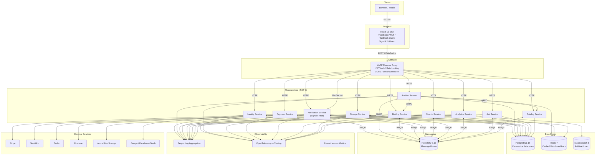
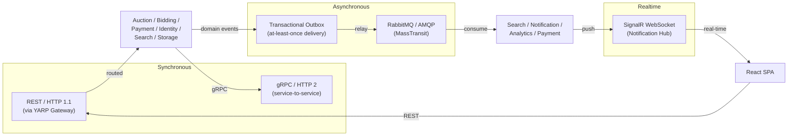
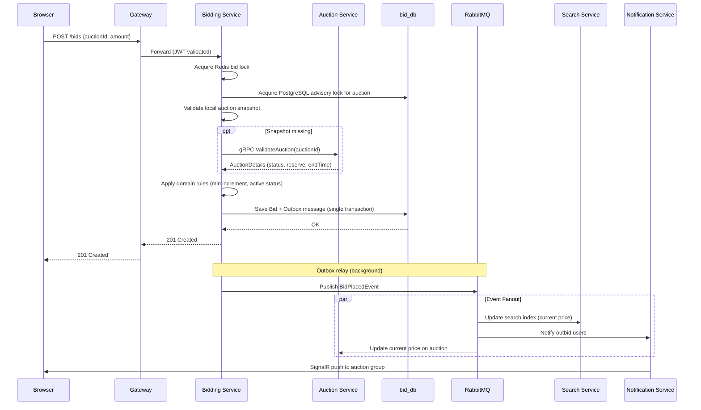
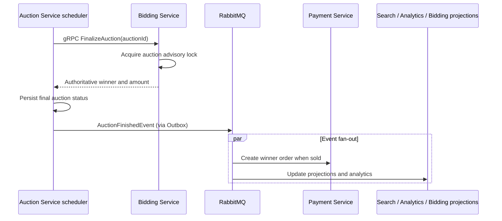
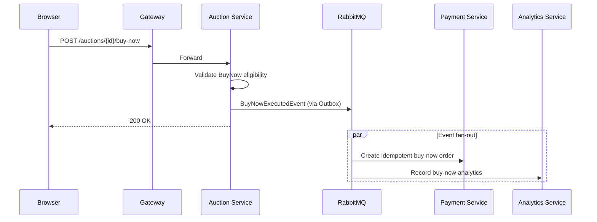
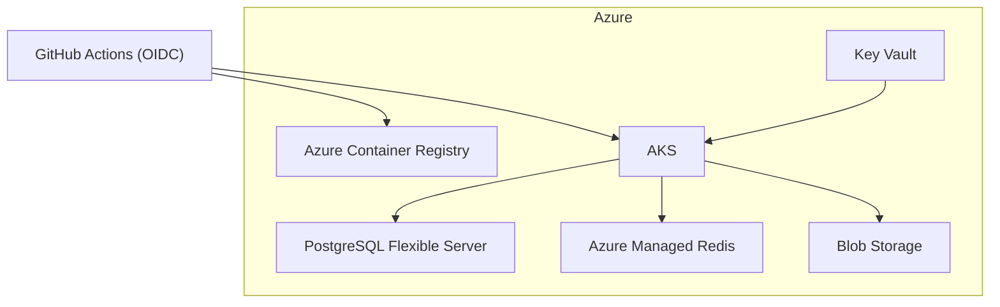
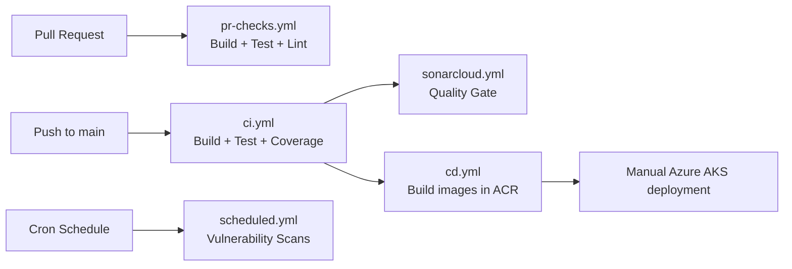
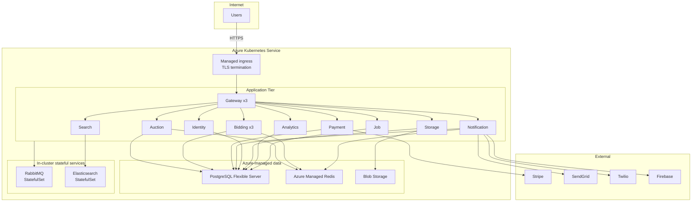

# Auction Platform — Microservices

A portfolio-focused, event-driven auction platform built with **.NET 9 microservices** and a **React 19 frontend**.
The system supports real-time bidding, authoritative auction closing, buy-now flows, integrated payments, multi-channel notifications, full-text search, file storage, analytics, and scheduled jobs — all behind a unified API gateway.

[](https://github.com/blanho/auction-platform-microservices/actions/workflows/ci.yml)
[](https://github.com/blanho/auction-platform-microservices/actions/workflows/cd.yml)
[](https://sonarcloud.io/summary/overall?id=auction-platform-microservices)

---

## Table of Contents

- [Architecture Overview](#architecture-overview)
- [System Architecture Diagram](#system-architecture-diagram)
- [Service Map](#service-map)
- [Tech Stack](#tech-stack)
- [Communication Patterns](#communication-patterns)
- [Key Workflows](#key-workflows)
  - [Place a Bid](#1-place-a-bid)
  - [Authoritative Auction Close](#2-authoritative-auction-close)
  - [Buy-Now Flow](#3-buy-now-flow)
- [Project Structure](#project-structure)
- [Getting Started](#getting-started)
- [Environment Variables](#environment-variables)
- [API Gateway Routes](#api-gateway-routes)
- [Cloud and Deployment](#cloud-and-deployment)
- [Observability](#observability)
- [Testing](#testing)
- [Code Quality](#code-quality)
- [Documentation](#documentation)

---

## Architecture Overview

The platform follows a **domain-driven microservices** architecture with strict bounded contexts. Each service owns its data, communicates asynchronously through RabbitMQ (via MassTransit), and exposes REST endpoints through a centralized YARP API gateway. Immediate authoritative queries use internal gRPC. The React frontend connects via REST and receives real-time updates through SignalR WebSockets.

**Core architectural patterns:**

| Pattern | Implementation |
|---|---|
| Domain-Driven Design | Bounded contexts per service, aggregates, value objects, domain events |
| CQRS | Separate command/query models via MediatR |
| Domain Events | Aggregate events published through transactional outboxes; current state remains in service databases |
| Event-driven workflows | MassTransit consumers with idempotent event handling; saga definitions are retained but not deployed |
| Transactional Outbox | Guaranteed message delivery via EF Core outbox |
| API Gateway | YARP reverse proxy with JWT validation and rate limiting |

---

## System Architecture Diagram

> Diagrams are written in **Mermaid** and render natively on GitHub.
> To edit visually, paste any block into [Mermaid Live](https://mermaid.live).


```mermaid
graph TB
    subgraph Clients
        Browser["Browser / Mobile"]
    end

    subgraph Frontend
        SPA["React 19 SPA<br/>TypeScript / MUI / TanStack Query<br/>SignalR / i18next"]
    end

    subgraph Gateway
        GW["YARP Reverse Proxy<br/>JWT Auth / Rate Limiting<br/>CORS / Security Headers"]
    end

    subgraph Services["Microservices (.NET 9)"]
        direction TB
        IDN["Identity Service"]
        AUC["Auction Service"]
        BID["Bidding Service"]
        PAY["Payment Service"]
        NOT["Notification Service<br/>(SignalR Hub)"]
        SRC["Search Service"]
        STR["Storage Service"]
        ANA["Analytics Service"]
        JOB["Job Service"]
        CAT["Catalog Service"]
    end

    subgraph Data["Data Stores"]
        PG[("PostgreSQL 16<br/>Per-service databases")]
        RD[("Redis 7<br/>Cache / Distributed Lock")]
        ES[("Elasticsearch 8<br/>Full-text Index")]
    end

    subgraph Messaging
        RMQ[("RabbitMQ 3.13<br/>Message Broker")]
    end

    subgraph Observability
        SEQ["Seq — Log Aggregation"]
        OTEL["OpenTelemetry — Tracing"]
        PROM["Prometheus — Metrics"]
    end

    subgraph External["External Services"]
        STRIPE["Stripe"]
        SENDGRID["SendGrid"]
        TWILIO["Twilio"]
        FIREBASE["Firebase"]
        AZURE["Azure Blob Storage"]
        OAUTH["Google / Facebook OAuth"]
    end

    Browser -->|HTTPS| SPA
    SPA -->|REST / WebSocket| GW
    GW -->|HTTP| IDN & AUC & BID & PAY & NOT & SRC & STR & ANA & JOB & CAT
    GW -->|WebSocket| NOT

    AUC <-->|gRPC| BID
    AUC -->|gRPC| CAT
    IDN & AUC & BID & PAY & NOT & SRC & STR & ANA & JOB & CAT <-->|AMQP| RMQ

    IDN & AUC & BID & PAY & NOT & STR & ANA & JOB & CAT --> PG
    AUC & BID & NOT --> RD
    SRC --> ES

    PAY --> STRIPE
    NOT --> SENDGRID & TWILIO & FIREBASE
    STR --> AZURE
    IDN --> OAUTH

    IDN & AUC & BID & PAY & NOT & SRC & STR & ANA & JOB --> SEQ
    IDN & AUC & BID & PAY & NOT & SRC & STR & ANA & JOB --> OTEL
```

---

## Service Map

| Service | Port | gRPC | Database | Responsibilities |
|---|---|---|---|---|
| **Identity** | 5001 | — | `identity_db` | JWT issuance, OAuth (Google / Facebook), user management |
| **Auction** | 5002 | 5011 | `auction_db` | Auction lifecycle, bookmarks, reviews, media, authoritative close scheduling |
| **Bidding** | 5003 | 5012 | `bid_db` | Bid placement, auto-bids, bid history, authoritative winner selection |
| **Payment** | 5004 | — | `payment_db` | Stripe integration, wallets, order processing, refunds |
| **Notification** | 5005 | — | `notification_db` | Email (SendGrid), SMS (Twilio), Push (Firebase), SignalR hub |
| **Job** | 5006 | — | `job_db` | General scheduled and operational jobs |
| **Analytics** | 5007 | — | `analytics_db` | Event ingestion, reporting, dashboards |
| **Catalog** | 5013 | 8081 internal | `catalog_db` | Categories, brands, catalog queries |
| **Search** | 5008 | — | Elasticsearch | Full-text auction search, filtering, facets |
| **Storage** | 5009 | — | `storage_db` | File upload, validation, Azure Blob / local storage |
| **Gateway** | 6001 | — | — | YARP reverse proxy, JWT validation, rate limiting |
| **Orchestration libraries** | — | — | — | Inactive saga definitions; no deployed host or persistence |

---

## Tech Stack

### Backend

| Category | Technology |
|---|---|
| Runtime | .NET 9, C# |
| Architecture | Clean Architecture (Domain / Application / Infrastructure / API) |
| API | ASP.NET Core Minimal API + Carter |
| CQRS / Mediator | MediatR |
| ORM | Entity Framework Core 9 |
| Messaging | MassTransit + RabbitMQ |
| Transactional Outbox | MassTransit Outbox (EF Core) |
| Workflow coordination | MassTransit consumers; inactive StateMachine definitions retained under `src/Orchestration` |
| gRPC | Grpc.AspNetCore / Grpc.Net.Client |
| API Gateway | YARP (Yet Another Reverse Proxy) |
| Auth | Custom JWT (HS256 / RS256), OAuth2 (Google, Facebook) |
| Caching | Redis (StackExchange.Redis) |
| Concurrency control | Redis distributed locks + PostgreSQL advisory locks for bid/finalization serialization |
| Search | Elasticsearch 8 (Elastic.Clients.Elasticsearch) |
| Logging | Serilog → Seq / Elasticsearch |
| Tracing | OpenTelemetry (OTLP-ready) |
| Validation | FluentValidation |
| Resilience | Polly (circuit breaker, retry, timeout, bulkhead) |
| Scheduling | Quartz / Hangfire (service-local background jobs) |
| Payment | Stripe .NET SDK |
| Email / SMS / Push | SendGrid, Twilio, Firebase Admin SDK |
| File Storage | Azure Blob Storage / Local |
| Testing | xUnit, NSubstitute, FluentAssertions |

### Frontend

| Category | Technology |
|---|---|
| Framework | React 19 |
| Language | TypeScript 5.9 |
| Build Tool | Vite 7 |
| UI Library | MUI (Material UI) v7 |
| Animations | Framer Motion 12 |
| Styling | Tailwind CSS 4 |
| State / Data Fetching | TanStack Query v5 |
| Routing | React Router v7 |
| Forms | React Hook Form + Zod |
| Real-time | @microsoft/signalr v10 |
| Charts | Recharts 3 |
| i18n | i18next + react-i18next |
| HTTP Client | Axios |
| Linting / Formatting | ESLint 9, Prettier 3, Husky + lint-staged |

---

## Communication Patterns


```mermaid
graph LR
    subgraph Synchronous
        REST["REST / HTTP 1.1<br/>(via YARP Gateway)"]
        GRPC["gRPC / HTTP 2<br/>(service-to-service)"]
    end

    subgraph Asynchronous
        OUTBOX["Transactional Outbox<br/>(at-least-once delivery)"]
        AMQP["RabbitMQ / AMQP<br/>(MassTransit)"]
    end

    subgraph Realtime
        WS["SignalR WebSocket<br/>(Notification Hub)"]
    end

    Frontend["React SPA"] --REST--> REST
    REST --routed--> Backends["Auction / Bidding /<br/>Payment / Identity /<br/>Search / Storage"]
    Backends --gRPC--> GRPC
    Backends --domain events--> OUTBOX
    OUTBOX --relay--> AMQP
    AMQP --consume--> Subscribers["Search / Notification /<br/>Analytics / Payment"]
    Subscribers --push--> WS
    WS --real-time--> Frontend
```

| Pattern | Where Used | Purpose |
|---|---|---|
| REST (HTTP/1.1) | Frontend → Gateway → Services | Standard CRUD operations and queries |
| gRPC (HTTP/2) | Auction ↔ Bidding; Auction → Catalog | Bid validation fallback, authoritative winner finalization, catalog queries |
| MassTransit + RabbitMQ | All services | Async domain events, integration events, commands |
| Transactional Outbox | Auction, Bidding, Payment | Guarantee message delivery after DB commit |
| Event fan-out | Payment, Search, Analytics, Notification | Idempotent reactions to committed integration events |
| SignalR | Notification → Browser | Real-time bid updates, auction status, notifications |
| CQRS | All domain services | Separate read/write models via MediatR |

---

## Key Workflows

### 1. Place a Bid


```mermaid
sequenceDiagram
    participant B as Browser
    participant GW as Gateway
    participant BID as Bidding Service
    participant AUC as Auction Service
    participant DB as bid_db
    participant MQ as RabbitMQ
    participant SRC as Search Service
    participant NOT as Notification Service

    B->>GW: POST /bids {auctionId, amount}
    GW->>BID: Forward (JWT validated)
    BID->>BID: Acquire Redis bid lock
    BID->>DB: Acquire PostgreSQL advisory lock for auction
    BID->>BID: Validate local auction snapshot
    opt Snapshot missing
        BID->>AUC: gRPC ValidateAuction(auctionId)
        AUC-->>BID: AuctionDetails (status, reserve, endTime)
    end
    BID->>BID: Apply domain rules (min increment, active status)
    BID->>DB: Save Bid + Outbox message (single transaction)
    DB-->>BID: OK
    BID-->>GW: 201 Created
    GW-->>B: 201 Created

    Note over BID,MQ: Outbox relay (background)
    BID->>MQ: Publish BidPlacedEvent

    par Event Fanout
        MQ->>SRC: Update search index (current price)
        MQ->>NOT: Notify outbid users
        MQ->>AUC: Update current price on auction
    end

    NOT->>B: SignalR push to auction group
```

### 2. Authoritative Auction Close


```mermaid
sequenceDiagram
    participant AUC as Auction Service scheduler
    participant BID as Bidding Service
    participant MQ as RabbitMQ
    participant PAY as Payment Service
    participant READ as Search / Analytics / Bidding projections

    AUC->>BID: gRPC FinalizeAuction(auctionId)
    BID->>BID: Acquire auction advisory lock
    BID-->>AUC: Authoritative winner and amount
    AUC->>AUC: Persist final auction status
    AUC->>MQ: AuctionFinishedEvent (via Outbox)
    par Event fan-out
        MQ->>PAY: Create winner order when sold
        MQ->>READ: Update projections and analytics
    end
```

Bid placement and winner selection use the same per-auction PostgreSQL advisory
lock. Once the auction end time has passed, this creates a single serialization
boundary between the last acceptable bid and the winning-bid read. The scheduled
close job itself also uses the shared Redis-backed job lock, so only one replica
processes a given schedule at a time.

### 3. Buy-Now Flow


```mermaid
sequenceDiagram
    participant B as Browser
    participant GW as Gateway
    participant AUC as Auction Service
    participant MQ as RabbitMQ
    participant PAY as Payment Service
    participant ANA as Analytics Service

    B->>GW: POST /auctions/{id}/buy-now
    GW->>AUC: Forward
    AUC->>AUC: Validate BuyNow eligibility
    AUC->>MQ: BuyNowExecutedEvent (via Outbox)
    AUC-->>B: 200 OK

    par Event fan-out
        MQ->>PAY: Create idempotent buy-now order
        MQ->>ANA: Record buy-now analytics
    end
```

---

## Project Structure

```
auction-platform-microservices/
├── Directory.Build.props              # Shared MSBuild properties
├── Directory.Packages.props           # Centralized NuGet package versions
├── global.json                        # Pinned .NET SDK version
├── auction.sln
│
├── src/
│   ├── BuildingBlocks/                # Shared cross-cutting libraries
│   │   ├── BuildingBlocks.Domain/     # Base entities, domain events, value objects
│   │   ├── BuildingBlocks.Application/# CQRS abstractions, behaviors, paging, filtering
│   │   ├── BuildingBlocks.Infrastructure/ # EF, Redis, MassTransit, Audit, Resilience
│   │   └── BuildingBlocks.Web/        # Auth, rate limiting, middleware, health checks
│   │
│   ├── Contracts/
│   │   └── Common.Contracts/          # Shared event base types, common enums
│   │
│   ├── Services/
│   │   ├── Auction/                   # Domain / Application / Infrastructure / API / tests
│   │   ├── Bidding/
│   │   ├── Catalog/
│   │   ├── Payment/
│   │   ├── Notification/
│   │   ├── Identity/
│   │   ├── Search/
│   │   ├── Storage/
│   │   ├── Analytics/
│   │   └── Job/
│   │
│   ├── Gateway/
│   │   └── Gateway.Api/               # YARP config, JWT middleware, rate limiting
│   │
│   └── Orchestration/
│       ├── Orchestration.Contracts/   # Inactive future orchestration contracts
│       └── Orchestration.Sagas/       # State-machine definitions; no deployed host
│
├── web/                               # React 19 SPA
│   └── src/
│       ├── modules/                   # Feature modules (auctions, bidding, auth, payments)
│       ├── shared/                    # Shared components, hooks, utils, theme
│       ├── services/                  # API clients, SignalR connection
│       ├── config/                    # Environment config
│       └── i18n/                      # Translations (en, vi)
│
├── docs/                              # Architecture and onboarding documentation
│
└── deploy/
    ├── docker/
    │   ├── docker-compose.yml         # Full local development stack
    │   └── scripts/init-databases.sh
    ├── config/
    │   └── appsettings.Production.template.json
    ├── kubernetes/
        ├── base/                      # Kustomize base manifests
        └── overlays/                  # dev / staging / production
    └── azure/                         # Bicep, Key Vault bootstrap, AKS render script
```

Each microservice follows **Clean Architecture** layering:

```
Services/{Name}/
├── {Name}.Contracts/       # Message contracts (co-located with service)
├── {Name}.Domain/          # Entities, Value Objects, Domain Events, Enums
├── {Name}.Application/     # Commands, Queries, Handlers, DTOs, Validators
├── {Name}.Infrastructure/  # EF DbContext, Repositories, External Service Clients
├── {Name}.Api/             # Minimal API Endpoints (Carter), gRPC, DI Configuration
└── tests/
    ├── {Name}.Domain.Tests/
    └── {Name}.Application.Tests/
```

---

## Getting Started

### Prerequisites

| Tool | Minimum Version |
|---|---|
| [.NET SDK](https://dotnet.microsoft.com/download) | 9.0 |
| [Node.js](https://nodejs.org) | 20 LTS |
| [Docker Desktop](https://www.docker.com/products/docker-desktop) | 24+ |
| [Docker Compose](https://docs.docker.com/compose/) | v2 |

### Local Development (Docker Compose)

```bash
# 1. Clone
git clone https://github.com/blanho/auction-platform-microservices.git
cd auction-platform-microservices

# 2. Configure environment
cp .env.example .env          # Fill in required values

# 3. Start everything
docker compose -f deploy/docker/docker-compose.yml up -d

# 4. Verify health
docker compose -f deploy/docker/docker-compose.yml ps

# 5. Start the frontend dev server
cd web && npm install && npm run dev
```

### Local Service URLs

| Service | URL |
|---|---|
| Frontend (dev) | http://localhost:5173 |
| API Gateway | http://localhost:6001 |
| Identity | http://localhost:5001 |
| Auction | http://localhost:5002 |
| Bidding | http://localhost:5003 |
| Payment | http://localhost:5004 |
| Notification | http://localhost:5005 |
| Analytics | http://localhost:5007 |
| Catalog | http://localhost:5013 |
| Search | http://localhost:5008 |
| Storage | http://localhost:5009 |
| RabbitMQ Management | http://localhost:15672 |
| Elasticsearch | http://localhost:9200 |
| Seq (Logs) | http://localhost:5341 |

### Running Individually

```bash
# Single backend service
cd src/Services/Auction/Auction.Api && dotnet run

# Frontend
cd web && npm install && npm run dev

# Current backend unit tests
dotnet test src/Services/Payment/tests/Payment.Domain.Tests/Payment.Domain.Tests.csproj

# Frontend validation
cd web && npm run validate
```

---

## Environment Variables

Copy `.env.example` to `.env` and fill in all values:

| Variable | Description |
|---|---|
| `POSTGRES_USER` / `POSTGRES_PASSWORD` | PostgreSQL credentials |
| `RABBITMQ_USER` / `RABBITMQ_PASS` | RabbitMQ credentials |
| `REDIS_PASSWORD` | Redis password |
| `JWT_SECRET_KEY` | Minimum 64-character random string |
| `STRIPE_SECRET_KEY` | From Stripe dashboard |
| `STRIPE_WEBHOOK_SECRET` | From Stripe webhook config |
| `SENDGRID_API_KEY` | SendGrid API key |
| `TWILIO_ACCOUNT_SID` / `TWILIO_AUTH_TOKEN` | Twilio credentials |
| `FIREBASE_SERVICE_ACCOUNT_JSON` | Firebase service account JSON |
| `GOOGLE_CLIENT_ID` / `GOOGLE_CLIENT_SECRET` | Google OAuth |
| `FACEBOOK_APP_ID` / `FACEBOOK_APP_SECRET` | Facebook OAuth |
| `FRONTEND_URL` | Frontend origin (e.g. `https://your-domain.com`) |
| `GATEWAY_URL` | API gateway URL (e.g. `https://api.your-domain.com`) |

---

## API Gateway Routes

All client traffic enters through the YARP gateway on port **6001**. JWT tokens are validated at the gateway before forwarding.

| Route | Upstream | Notes |
|---|---|---|
| `/auctions/**` | Auction Service | Rate limited |
| `/categories/**` | Catalog Service | |
| `/brands/**` | Catalog Service | |
| `/bookmarks/**` | Auction Service | Auth required |
| `/reviews/**` | Auction Service | |
| `/bids/**` | Bidding Service | Rate limited |
| `/autobids/**` | Bidding Service | Rate limited |
| `/payments/**` | Payment Service | Auth required |
| `/identity/**` | Identity Service | |
| `/search/**` | Search Service | |
| `/storage/**` | Storage Service | Auth required |
| `/analytics/**` | Analytics Service | Auth required |
| `/hubs/**` | Notification Service | WebSocket |

---

## Cloud and Deployment

### Docker Compose (Local)

`deploy/docker/docker-compose.yml` defines the complete local stack:
- **5 infrastructure services** — PostgreSQL, Redis, RabbitMQ, Elasticsearch, Seq
- **11 backend containers** — 10 microservices plus the gateway
- **1 frontend container** — Nginx-served React SPA
- Health checks on every container, named volumes, shared bridge network
- Frontend available at **http://localhost:3000** when running the full Compose stack

### Azure AKS (Production)

The supported production path is Azure. It uses Bicep for infrastructure and
Kustomize for the application manifests:


```mermaid
graph TB
    subgraph Azure
        ACR["Azure Container Registry"]
        AKS["AKS"]
        KV["Key Vault"]
        PG["PostgreSQL Flexible Server"]
        REDIS["Azure Managed Redis"]
        BLOB["Blob Storage"]
    end

    GH["GitHub Actions (OIDC)"] --> ACR
    GH --> AKS
    KV --> AKS
    AKS --> PG & REDIS & BLOB
```

RabbitMQ and Elasticsearch remain in AKS because replacing either one requires
application code and data-migration work. PostgreSQL, Redis, Blob Storage,
container images, secrets, TLS, and workload identity are Azure-managed.

For provisioning, required GitHub variables, DNS, and the manual production
rollout, follow the [Azure deployment guide](deploy/azure/README.md).

### CI/CD Pipelines

GitHub Actions workflows in `.github/workflows/`:


```mermaid
graph LR
    PR["Pull Request"] --> PRC["pr-checks.yml<br/>Build + Test + Lint"]
    Push["Push to main"] --> CI["ci.yml<br/>Build + Test + Coverage"]
    CI --> SONAR["sonarcloud.yml<br/>Quality Gate"]
    CI --> CD["cd.yml<br/>Build images in ACR"]
    CD --> DEPLOY["Manual Azure AKS deployment"]
    CRON["Cron Schedule"] --> SCHED["scheduled.yml<br/>Vulnerability Scans"]
```

| Workflow | Trigger | Purpose |
|---|---|---|
| `ci.yml` | Push / pull request | Validate frontend, build and test backend, compile Bicep |
| `cd.yml` | Successful main CI / manual run | Build immutable ACR images; deploy to AKS only when manually enabled |
| `pr-checks.yml` | Pull request | Validate build, tests, and lint before merge |
| `sonarcloud.yml` | CI pipeline | Static analysis, enforce quality gate |
| `scheduled.yml` | Cron | Dependency vulnerability scans |

### Deployment Topology


```mermaid
graph TB
    subgraph Internet
        Users["Users"]
    end

    subgraph AKS["Azure Kubernetes Service"]
        ING["Managed ingress<br/>TLS termination"]

        subgraph App["Application Tier"]
            GW["Gateway x3"]
            AUC["Auction"]
            BID["Bidding x3"]
            PAY["Payment"]
            NOT["Notification"]
            IDN["Identity"]
            SRC["Search"]
            STR["Storage"]
            ANA["Analytics"]
            JOB["Job"]
        end

        subgraph DataLayer["Azure-managed data"]
            PG["PostgreSQL Flexible Server"]
            RD["Azure Managed Redis"]
            BLOB["Blob Storage"]
        end

        subgraph InCluster["In-cluster stateful services"]
            RMQ["RabbitMQ<br/>StatefulSet"]
            ES["Elasticsearch<br/>StatefulSet"]
        end
    end

    subgraph Ext["External"]
        STRIPE["Stripe"]
        SG["SendGrid"]
        TW["Twilio"]
        FB["Firebase"]
    end

    Users -->|HTTPS| ING
    ING --> GW
    GW --> AUC & BID & PAY & NOT & IDN & SRC & STR & ANA & JOB
    AUC & BID & PAY & NOT & IDN & STR & ANA & JOB --> PG
    AUC & BID & NOT --> RD
    SRC --> ES
    App --> RMQ
    PAY --> STRIPE
    NOT --> SG & TW & FB
    STR --> BLOB
```

---

## Observability

| Tool | Purpose | Access |
|---|---|---|
| Seq (local only) | Centralized structured log aggregation | http://localhost:5341 |
| Serilog | Structured logging with correlation IDs | Per-service config |
| OpenTelemetry | Distributed tracing instrumentation | Configurable OTLP collector |
| Azure Monitor / Log Analytics | AKS platform logs and metrics | Azure portal |
| SonarCloud | Static code analysis and coverage | [Dashboard](https://sonarcloud.io/summary/overall?id=auction-platform-microservices) |

**Health check endpoints** (every service):

```
GET /health        # Overall health
GET /health/ready  # Readiness probe (K8s)
GET /health/live   # Liveness probe (K8s)
```

Production deployment does not install Jaeger, Seq, or Prometheus CRDs. Add a
managed observability integration only when the project needs it.

---

## Testing

The current suite contains Payment domain tests and Bidding infrastructure tests
for authoritative finalization and per-auction serialization. CI discovers every
`*Tests.csproj` under `src`; add tests next to each service as the project grows.

```bash
dotnet test src/Services/Bidding/tests/Bidding.Infrastructure.Tests/Bidding.Infrastructure.Tests.csproj
dotnet test src/Services/Payment/tests/Payment.Domain.Tests/Payment.Domain.Tests.csproj
cd web && npm run validate                         # Frontend
```

---

## Code Quality

- **SonarCloud** — automated quality gate on every push
- **ESLint 9** + **Prettier 3** — frontend style enforcement
- **Husky + lint-staged** — pre-commit hooks
- **FluentValidation** — request validation on all command handlers
- **Directory.Packages.props** — centralized NuGet version pinning

---

## Documentation

| Document | Description |
|---|---|
| [Architecture Guide](docs/architecture.md) | System design, bounded contexts, data flow, design decisions |
| [Getting Started Guide](docs/getting-started.md) | Step-by-step onboarding for new developers |
| [API Reference](docs/api-reference.md) | Gateway routes, authentication, request/response schemas |
| [Deployment Guide](docs/deployment.md) | Docker, Kubernetes, CI/CD pipeline details |
| [Azure Deployment Guide](deploy/azure/README.md) | Provision and deploy the Azure AKS environment |

---

## License

This project is for educational and portfolio purposes.
