# 🏷️ Auction Platform — Microservices

A production-grade, event-driven auction platform built with **.NET 9 microservices** and a **React 19 frontend**.  
The system supports real-time bidding, automated auction completion sagas, buy-now flows, integrated payments, push/email/SMS notifications, full-text search, file storage, analytics, and scheduled jobs — all behind a unified API gateway.

---

## 📑 Table of Contents

- [Architecture Overview](#architecture-overview)
- [Service Map](#service-map)
- [Tech Stack](#tech-stack)
- [Communication Patterns](#communication-patterns)
- [Key Workflows](#key-workflows)
  - [Place a Bid](#1-place-a-bid)
  - [Auction Completion Saga](#2-auction-completion-saga)
  - [Buy-Now Flow](#3-buy-now-flow)
- [Project Structure](#project-structure)
- [Getting Started](#getting-started)
  - [Prerequisites](#prerequisites)
  - [Local Development (Docker Compose)](#local-development-docker-compose)
  - [Running Individually](#running-individually)
- [Environment Variables](#environment-variables)
- [API Gateway Routes](#api-gateway-routes)
- [Kubernetes Deployment](#kubernetes-deployment)
- [Observability](#observability)
- [Testing](#testing)
- [Code Quality](#code-quality)

---

## Architecture Overview

> Diagrams below are written in **Mermaid** and render natively on GitHub.  
> To edit visually, paste any block into [Mermaid Live](https://mermaid.live) or import into Lucidchart via **Insert → Advanced → Mermaid**.

```mermaid
graph TB
    Browser["🌐 Browser / Mobile"]

    subgraph Frontend["Frontend — React 19 + Vite"]
        UI["React SPA\nTypeScript · MUI · TanStack Query\nSignalR · Recharts · i18next"]
    end

    subgraph Gateway["API Gateway"]
        GW["YARP Reverse Proxy\n:6001\nJWT Auth · Rate Limiting\nCORS · Security Headers"]
    end

    subgraph Services["Backend Microservices (.NET 9)"]
        direction TB
        AUC["🔨 Auction Service\n:5001 HTTP | :5011 gRPC"]
        BID["💰 Bidding Service\n:5002 HTTP | :5012 gRPC"]
        PAY["💳 Payment Service\n:5004"]
        NOT["🔔 Notification Service\n:5005\nSignalR Hub"]
        IDN["🔐 Identity Service\n:5001\nJWT · OAuth"]
        SRC["🔍 Search Service\n:5008"]
        STR["📁 Storage Service\n:5009"]
        ANA["📊 Analytics Service\n:5007"]
        JOB["⚙️ Job Service\n:5006"]
        ORC["🎭 Orchestration\n(Saga Runner)\nMassTransit StateMachine"]
    end

    subgraph Infrastructure["Infrastructure"]
        PG[("🐘 PostgreSQL 16\nPer-service databases")]
        RD[("⚡ Redis 7\nCaching · Distributed Lock\nSession")]
        RMQ[("🐇 RabbitMQ 3.13\nMessage Broker")]
        ES[("🔎 Elasticsearch 8\nFull-text Index")]
        SEQ["📋 Seq\nLog Aggregation"]
        JAG["🔭 Jaeger\nDistributed Tracing (OTLP)"]
    end

    subgraph External["External Services"]
        STRIPE["Stripe\nPayment Processing"]
        SENDGRID["SendGrid\nEmail"]
        TWILIO["Twilio\nSMS"]
        FIREBASE["Firebase\nPush Notifications"]
        AZURE_BLOB["Azure Blob Storage\n(optional)"]
        GOOGLE["Google OAuth"]
        FACEBOOK["Facebook OAuth"]
    end

    Browser -->|HTTPS| Frontend
    Frontend -->|REST / WebSocket| GW
    GW -->|HTTP REST| AUC & BID & PAY & NOT & IDN & SRC & STR & ANA & JOB
    GW -->|WebSocket| NOT

    AUC <-->|gRPC| BID
    AUC & BID & PAY & NOT & IDN & SRC & STR & ANA & JOB & ORC <-->|AMQP| RMQ

    AUC & BID & PAY & NOT & IDN & STR & ANA & JOB --> PG
    AUC & BID & NOT --> RD
    SRC --> ES
    NOT --> SENDGRID & TWILIO & FIREBASE
    PAY --> STRIPE
    STR --> AZURE_BLOB
    IDN --> GOOGLE & FACEBOOK

    Services --> SEQ
    Services --> JAG
```



---

## Service Map

| Service | Port (HTTP) | gRPC Port | Database | Responsibilities |
|---|---|---|---|---|
| **Identity** | 5001 | — | `identity_db` | JWT issuance, OAuth (Google/Facebook), user management |
| **Auction** | 5002 | 5011 | `auction_db` | Auction CRUD, categories, brands, bookmarks, reviews, media |
| **Bidding** | 5003 | 5012 | `bid_db` | Place bids, auto-bids, bid history, retract bid |
| **Payment** | 5004 | — | `payment_db` | Stripe integration, order processing, refunds |
| **Notification** | 5005 | — | `notification_db` | Email (SendGrid), SMS (Twilio), Push (Firebase), SignalR hub |
| **Job** | 5006 | — | `job_db` | Scheduled background tasks (auction lifecycle, cleanup) |
| **Analytics** | 5007 | — | `analytics_db` | Event ingestion, reporting, dashboards |
| **Search** | 5008 | — | Elasticsearch | Full-text auction search, filtering, facets |
| **Storage** | 5009 | — | `storage_db` | File upload, validation, Azure Blob / local storage |
| **Gateway** | 6001 | — | — | YARP reverse proxy, JWT validation, rate limiting |
| **Orchestration** | — | — | `saga_db` (RMQ) | MassTransit sagas: AuctionCompletion, BuyNow |

---

## Tech Stack

### Backend

| Category | Technology |
|---|---|
| Runtime | .NET 9 |
| Architecture | Clean Architecture (Domain · Application · Infrastructure · API) |
| API | ASP.NET Core Minimal API + Carter |
| CQRS / Mediator | MediatR |
| ORM | Entity Framework Core 9 |
| Messaging | MassTransit + RabbitMQ |
| Transactional Outbox | MassTransit Outbox (EF Core) |
| Saga Orchestration | MassTransit StateMachine |
| gRPC | Grpc.AspNetCore / Grpc.Net.Client |
| API Gateway | YARP (Yet Another Reverse Proxy) |
| Auth | Custom JWT (HS256/RS256), OAuth2 |
| Caching | Redis (StackExchange.Redis) |
| Distributed Lock | Redis (Redlock pattern) |
| Search | Elasticsearch 8 (NEST / Elastic.Clients.Elasticsearch) |
| Logging | Serilog → Seq |
| Tracing | OpenTelemetry → Jaeger (OTLP) |
| Validation | FluentValidation |
| Resilience | Polly |
| Scheduling | Hangfire / Quartz (Job Service) |
| Payment | Stripe .NET SDK |
| Email | SendGrid |
| SMS | Twilio |
| Push Notifications | Firebase Admin SDK |
| File Storage | Local or Azure Blob Storage |
| Audit | Custom audit publisher (EF ChangeTracker) |
| API Versioning | Asp.Versioning |
| OpenAPI | Scalar / Swashbuckle |
| Testing | xUnit, NSubstitute, FluentAssertions |
| Containerization | Docker + Docker Compose |
| Orchestration | Kubernetes + Kustomize |

### Frontend

| Category | Technology |
|---|---|
| Framework | React 19 |
| Language | TypeScript 5.9 |
| Build Tool | Vite 7 |
| UI Library | MUI (Material UI) v7 |
| Animations | Framer Motion 12 |
| Styling | Tailwind CSS 4 |
| State / Data Fetching | TanStack Query v5 |
| Routing | React Router v7 |
| Forms | React Hook Form + Zod |
| Real-time | @microsoft/signalr v10 |
| Charts | Recharts 3 |
| i18n | i18next + react-i18next |
| HTTP Client | Axios |
| File Upload | react-dropzone |
| Linting | ESLint 9 |
| Formatting | Prettier 3 |
| Git Hooks | Husky + lint-staged |

---

## Communication Patterns

```mermaid
graph LR
    subgraph Sync["Synchronous"]
        REST["REST over HTTP/1.1\n(via YARP Gateway)"]
        GRPC["gRPC / HTTP2\n(service-to-service)"]
    end

    subgraph Async["Asynchronous"]
        AMQP["RabbitMQ / AMQP\n(MassTransit events)"]
        SAGA["Saga State Machine\n(compensating transactions)"]
        OUTBOX["Transactional Outbox\n(at-least-once delivery)"]
    end

    subgraph Realtime["Real-time"]
        WS["SignalR WebSocket\n(Notification Hub)"]
    end

    Frontend --"REST"--> REST
    REST --"routed"--> AUC_BID_etc["Auction / Bidding /\nPayment / Identity\n/ Search / Storage"]
    AUC_BID_etc --"gRPC\nAuction ↔ Bidding"--> GRPC
    AUC_BID_etc --"publish domain events"--> OUTBOX
    OUTBOX --"relay"--> AMQP
    AMQP --"consume"--> SAGA
    AMQP --"consume"--> Subscribers["Search / Notification\n/ Analytics / Orchestration"]
    Subscribers --"real-time push"--> WS
    WS --"push"--> Frontend
```



### Pattern Details

| Pattern | Where Used | Purpose |
|---|---|---|
| **REST (HTTP/1.1)** | Frontend → Gateway → Services | Standard CRUD, queries |
| **gRPC (HTTP/2)** | Auction ↔ Bidding | Low-latency cross-service queries (e.g. validate auction exists before bid) |
| **MassTransit + RabbitMQ** | All services | Async domain events, commands, integration events |
| **Transactional Outbox** | Auction, Bidding, Payment | Guarantee message is published only after DB commit |
| **Saga (StateMachine)** | Orchestration service | Coordinate multi-step transactions with compensation |
| **SignalR** | Notification → Browser | Real-time bid updates, auction status, notifications |
| **CQRS** | All domain services | Separate read/write models via MediatR |

---

## Key Workflows

### 1. Place a Bid


---

### 2. Auction Completion Saga


---

### 3. Buy-Now Flow


---

## Project Structure

```
auction-platform-microservices/
├── src/
│   ├── BuildingBlocks/               # Shared cross-cutting libraries
│   │   ├── BuildingBlocks.Domain/    # Base entities, domain events, value objects
│   │   ├── BuildingBlocks.Application/  # CQRS abstractions, behaviors, paging, filtering
│   │   ├── BuildingBlocks.Infrastructure/  # EF, Redis, MassTransit, Audit, Resilience
│   │   └── BuildingBlocks.Web/       # Auth, rate limiting, middleware, health checks
│   │
│   ├── Contracts/                    # Shared message contracts (per service)
│   │   ├── AuctionService.Contracts/
│   │   ├── BidService.Contracts/
│   │   ├── PaymentService.Contracts/
│   │   └── ...
│   │
│   ├── Services/
│   │   ├── Auction/
│   │   │   ├── Auction.Domain/       # Entities, Enums, Domain Events
│   │   │   ├── Auction.Application/  # Commands, Queries, DTOs, Event Handlers
│   │   │   ├── Auction.Infrastructure/ # EF DbContext, Repositories, MassTransit
│   │   │   └── Auction.Api/          # Minimal API Endpoints, gRPC, Carter Modules
│   │   ├── Bidding/    (same layering)
│   │   ├── Payment/    (same layering)
│   │   ├── Notification/ (same layering)
│   │   ├── Identity/
│   │   ├── Search/
│   │   ├── Storage/    (same layering)
│   │   ├── Analytics/
│   │   └── Job/        (same layering)
│   │
│   ├── Gateway/
│   │   └── Gateway.Api/              # YARP config, JWT middleware, rate limits
│   │
│   └── Orchestration/
│       └── Orchestration.Sagas/      # MassTransit saga state machines
│
├── web/                              # React 19 SPA
│   ├── src/
│   │   ├── modules/                  # Feature modules (auctions, bidding, auth, ...)
│   │   ├── shared/                   # Shared components, hooks, utils, theme
│   │   ├── services/                 # API clients
│   │   ├── config/                   # App config, env
│   │   └── i18n/                     # Translations
│   └── vite.config.ts
│
├── tests/
│   ├── Auction.Domain.Tests/
│   ├── Auction.Application.Tests/
│   ├── Bidding.Domain.Tests/
│   └── Bidding.Application.Tests/
│
└── deploy/
    ├── docker/
    │   ├── docker-compose.yml        # Full local stack
    │   └── scripts/init-databases.sh
    ├── config/
    │   └── appsettings.Production.template.json
    └── kubernetes/
        ├── base/                     # Kustomize base manifests
        └── overlays/
            ├── dev/
            ├── staging/
            └── production/
```

---

## Getting Started

### Prerequisites

| Tool | Minimum Version |
|---|---|
| [.NET SDK](https://dotnet.microsoft.com/download) | 9.0 |
| [Node.js](https://nodejs.org) | 20 LTS |
| [Docker Desktop](https://www.docker.com/products/docker-desktop) | 24+ |
| [Docker Compose](https://docs.docker.com/compose/) | v2 |

---

### Local Development (Docker Compose)

**1. Clone & configure environment**

```bash
git clone https://github.com/your-org/auction-platform-microservices.git
cd auction-platform-microservices
cp .env.example .env
# Fill in all required values in .env
```

**2. Start the full infrastructure + services**

```bash
docker-compose -f deploy/docker/docker-compose.yml up -d
```

**3. Verify all services are healthy**

```bash
docker-compose -f deploy/docker/docker-compose.yml ps
```

**4. Start the frontend**

```bash
cd web
npm install
npm run dev
# App: http://localhost:5173
```

#### Service URLs (Docker)

| Service | URL |
|---|---|
| Gateway (API entry point) | http://localhost:6001 |
| Identity Service | http://localhost:5001 |
| Auction Service | http://localhost:5002 |
| Bidding Service | http://localhost:5003 |
| Payment Service | http://localhost:5004 |
| Notification Service | http://localhost:5005 |
| Analytics Service | http://localhost:5007 |
| Search Service | http://localhost:5008 |
| Storage Service | http://localhost:5009 |
| RabbitMQ Management | http://localhost:15672 |
| Elasticsearch | http://localhost:9200 |
| Seq (logs) | http://localhost:5341 |
| Frontend (dev) | http://localhost:5173 |

---

### Running Individually

**Backend — single service**

```bash
# Copy and configure appsettings.Development.json for the target service
cd src/Services/Auction/Auction.Api
dotnet run
```

**Frontend**

```bash
cd web
npm install
npm run dev
```

**Run tests**

```bash
# All backend tests
dotnet test

# Single suite
dotnet test tests/Auction.Application.Tests

# Frontend lint + typecheck
cd web && npm run validate
```

---

## Environment Variables

Copy `.env.example` to `.env` and fill in all values. Key variables:

| Variable | Description |
|---|---|
| `POSTGRES_USER` / `POSTGRES_PASSWORD` | PostgreSQL credentials |
| `RABBITMQ_USER` / `RABBITMQ_PASS` | RabbitMQ credentials |
| `REDIS_PASSWORD` | Redis password |
| `JWT_SECRET_KEY` | Minimum 64-character random string |
| `STRIPE_SECRET_KEY` | From Stripe dashboard |
| `STRIPE_WEBHOOK_SECRET` | From Stripe webhook config |
| `SENDGRID_API_KEY` | SendGrid API key |
| `TWILIO_ACCOUNT_SID` / `TWILIO_AUTH_TOKEN` | Twilio credentials |
| `FIREBASE_SERVICE_ACCOUNT_JSON` | Firebase service account JSON |
| `GOOGLE_CLIENT_ID` / `GOOGLE_CLIENT_SECRET` | Google OAuth |
| `FACEBOOK_APP_ID` / `FACEBOOK_APP_SECRET` | Facebook OAuth |
| `FRONTEND_URL` | e.g. `https://your-domain.com` |
| `GATEWAY_URL` | e.g. `https://api.your-domain.com` |

See [.env.example](.env.example) for the full list and generation hints.

---

## API Gateway Routes

All client traffic enters through the YARP gateway on `:6001`. JWT tokens are validated at the gateway before forwarding.

| Public Path | Upstream Service | Notes |
|---|---|---|
| `/auctions/{**}` | Auction Service | Rate limited |
| `/categories/{**}` | Auction Service | |
| `/brands/{**}` | Auction Service | |
| `/bookmarks/{**}` | Auction Service | Auth required |
| `/reviews/{**}` | Auction Service | |
| `/bids/{**}` | Bidding Service | Rate limited |
| `/autobids/{**}` | Bidding Service | Rate limited |
| `/payments/{**}` | Payment Service | |
| `/identity/{**}` | Identity Service | |
| `/search/{**}` | Search Service | |
| `/storage/{**}` | Storage Service | |
| `/analytics/{**}` | Analytics Service | |
| `/hubs/{**}` | Notification Service | WebSocket upgrade |

---

## Kubernetes Deployment

The `deploy/kubernetes` directory uses **Kustomize** with three overlays:

```bash
# Development
kubectl apply -k deploy/kubernetes/overlays/dev

# Staging
kubectl apply -k deploy/kubernetes/overlays/staging

# Production
kubectl apply -k deploy/kubernetes/overlays/production
```

Base manifests include: `namespace`, `configmap`, `secrets` (template), `ingress`, `rbac`, `priority-classes`, per-service Deployments and Services.

---

## Observability


| Tool | Access | Purpose |
|---|---|---|
| **Seq** | http://localhost:5341 | Structured log search and alerting |
| **Jaeger** | http://localhost:16686 | Distributed trace visualisation |
| **Health checks** | `GET /health` on each service | Liveness / readiness probes |
| **OpenAPI / Scalar** | `GET /scalar` (dev only) | Interactive API docs per service |
| **RabbitMQ UI** | http://localhost:15672 | Queue / exchange monitoring |

OpenTelemetry instrumentation covers: ASP.NET Core, HttpClient, EF Core, MassTransit — all correlated via trace/span IDs.

---

## Testing

```
tests/
├── Auction.Domain.Tests/       # Domain entity & value-object unit tests
├── Auction.Application.Tests/  # Command/query handler tests (NSubstitute mocks)
├── Bidding.Domain.Tests/       # Bid domain logic tests
└── Bidding.Application.Tests/  # Bidding handlers (PlaceBid, AutoBid, ...)
```

```bash
dotnet test --logger "console;verbosity=normal"
dotnet test --collect:"XPlat Code Coverage"
```

---

## Code Quality

| Tool | Scope | Config |
|---|---|---|
| **SonarQube** | Backend static analysis | `sonar-project.properties` |
| **ESLint 9** | Frontend TypeScript | `web/eslint.config.js` |
| **Prettier 3** | Frontend formatting | `web/.prettierrc` |
| **Husky + lint-staged** | Pre-commit hooks | `web/.husky/` |
| **FluentValidation** | Backend request validation | Per command/query |

> See [.github/copilot-instructions.md](.github/copilot-instructions.md) for code style rules:  
> **no inline comments**, self-documenting method/variable names, SOLID principles.
