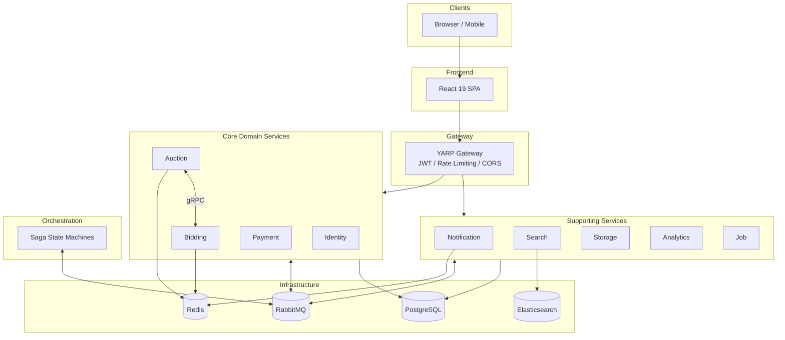
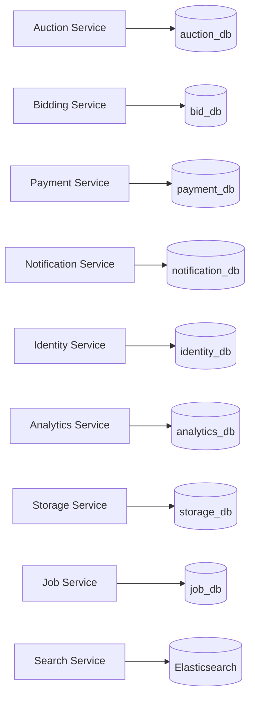
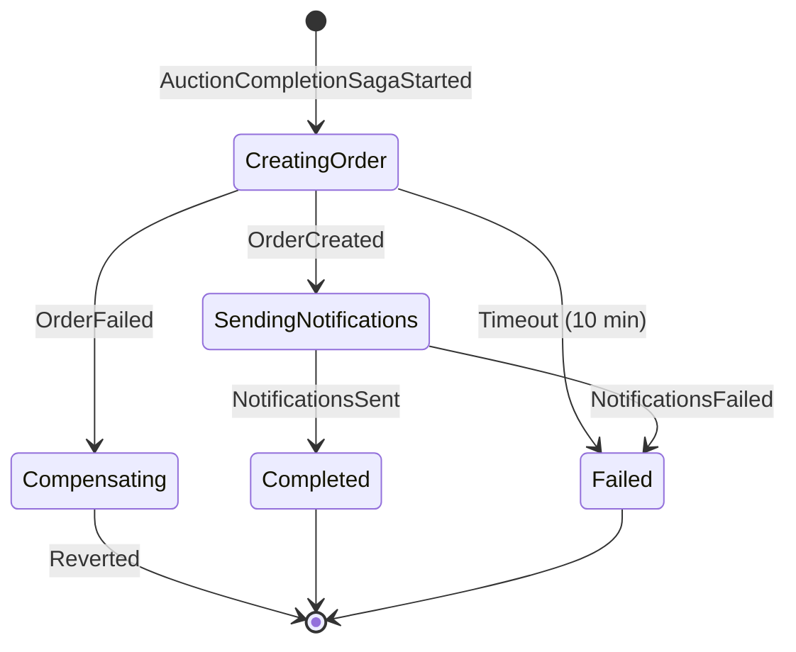
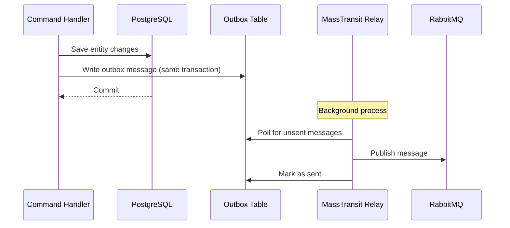
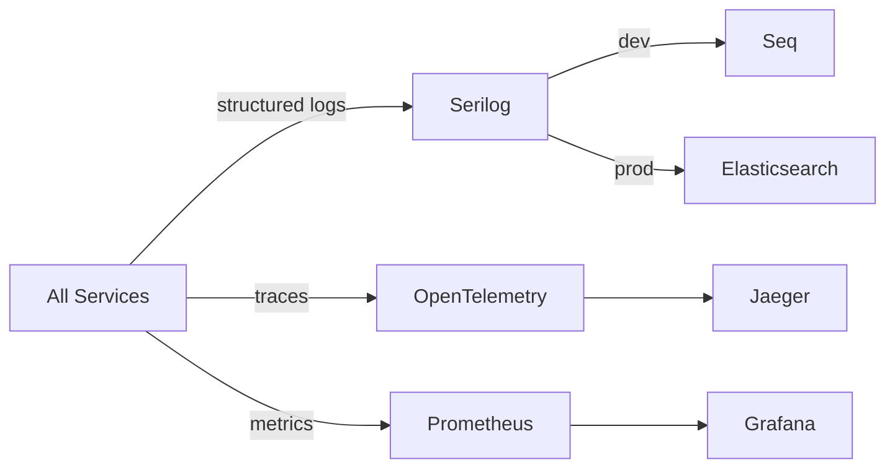

# Architecture Guide

This document explains how the auction platform is designed, how services interact, and the reasoning behind key architectural decisions. Read this before diving into any service codebase.

---

## Table of Contents

- [High-Level Architecture](#high-level-architecture)
- [Bounded Contexts](#bounded-contexts)
- [Service Responsibilities](#service-responsibilities)
- [Clean Architecture (Per Service)](#clean-architecture-per-service)
- [Data Ownership](#data-ownership)
- [Communication Patterns](#communication-patterns)
- [CQRS and MediatR](#cqrs-and-mediatr)
- [Event Sourcing](#event-sourcing)
- [Saga Orchestration](#saga-orchestration)
- [Transactional Outbox](#transactional-outbox)
- [API Gateway (YARP)](#api-gateway-yarp)
- [Real-Time with SignalR](#real-time-with-signalr)
- [Resilience Patterns](#resilience-patterns)
- [Security Model](#security-model)
- [Observability Strategy](#observability-strategy)
- [Design Decisions and Trade-offs](#design-decisions-and-trade-offs)

---

## High-Level Architecture

The platform is composed of **10 microservices**, a **YARP API gateway**, a **React SPA**, and shared **BuildingBlocks** libraries. Each service is independently deployable and owns its bounded context.



---

## Bounded Contexts

Each microservice maps to a single bounded context. Services never share databases or domain models.

| Bounded Context | Service | Core Domain Concepts |
|---|---|---|
| **Identity & Access** | Identity Service | Users, Roles, Tokens, OAuth Providers |
| **Auction Management** | Auction Service | Auctions, Categories, Brands, Bookmarks, Reviews, Media |
| **Bidding** | Bidding Service | Bids, AutoBids, Bid History, Auction Snapshots |
| **Payment & Orders** | Payment Service | Wallets, Orders, Stripe Intents, Refunds |
| **Notifications** | Notification Service | Notification Templates, Channels (Email/SMS/Push/SignalR) |
| **Search & Discovery** | Search Service | Search Index, Filters, Facets |
| **File Management** | Storage Service | Files, Upload Validation, Blob Storage |
| **Analytics** | Analytics Service | Events, Reports, Dashboards |
| **Scheduling** | Job Service | Scheduled Tasks, Auction Lifecycle Triggers |
| **Transaction Coordination** | Orchestration | Saga State Machines (AuctionCompletion, BuyNow) |

**Rules:**
- Services communicate only through messages (RabbitMQ) or synchronous queries (REST/gRPC)
- Each service defines its own contracts in `{Service}.Contracts/`
- Shared contracts (common enums, base event types) live in `src/Contracts/Common.Contracts/`

---

## Service Responsibilities

### Core Domain Services

**Identity Service** — Handles authentication and user management. Issues JWT tokens (HS256/RS256). Supports Google and Facebook OAuth. All other services validate tokens but never issue them.

**Auction Service** — The central domain service. Manages the auction lifecycle (Draft → Active → Finishing → Finished/Sold/Cancelled). Handles categories, brands, bookmarks, reviews, and media. Exposes a gRPC endpoint for the Bidding Service to validate auction state before accepting bids.

**Bidding Service** — Manages bid placement with domain rules (minimum increment, active auction, no self-bidding). Supports auto-bids (proxy bidding). Maintains auction snapshots (denormalized read models) for fast validation. Uses distributed locking (Redis) to prevent race conditions on concurrent bids.

**Payment Service** — Integrates with Stripe for payment processing. Manages user wallets and order records. Creates payment intents during buy-now and auction completion sagas.

### Supporting Services

**Notification Service** — Multi-channel notifications (Email via SendGrid, SMS via Twilio, Push via Firebase). Hosts the SignalR hub for real-time browser updates. Uses notification templates for consistent messaging.

**Search Service** — Maintains an Elasticsearch index of auctions. Consumes domain events to keep the index in sync. Provides full-text search, filtering, and faceted navigation.

**Storage Service** — File upload and management. Validates file types and sizes. Stores files in Azure Blob Storage (production) or local filesystem (development).

**Analytics Service** — Ingests domain events for reporting. Provides dashboard data for auction performance, user activity, and revenue metrics.

**Job Service** — Scheduled background tasks using Hangfire/Quartz. Key job: checking for auctions that have reached their end time and publishing `AuctionFinishedEvent` to trigger the completion saga.

### Orchestration

**Saga State Machines** — MassTransit state machines that coordinate multi-step transactions across services. Two primary sagas:

1. **AuctionCompletionSaga** — Triggered when an auction ends. Creates an order (Payment), sends notifications (Notification), and marks the auction finished (Auction).
2. **BuyNowSaga** — Triggered when a buyer uses the buy-now option. Creates a payment intent, notifies parties, and finalizes the auction.

Each saga step has a compensating action for rollback on failure.

---

## Clean Architecture (Per Service)

Every microservice follows a four-layer architecture:

```
{Service}.Domain/          # Layer 0 — No dependencies on other layers
{Service}.Application/     # Layer 1 — Depends only on Domain
{Service}.Infrastructure/  # Layer 2 — Depends on Domain + Application
{Service}.Api/             # Layer 3 — Depends on all layers (composition root)
```

### Domain Layer
- Entities with private setters (encapsulation)
- Value Objects (e.g., Money, BidAmount)
- Domain Events (raised within aggregates)
- Enums representing domain concepts
- No references to infrastructure, EF Core, or external libraries

### Application Layer
- Commands and Queries (CQRS via MediatR)
- Command/Query Handlers
- DTOs and mapping
- Validation (FluentValidation)
- Pipeline behaviors (logging, validation, transaction)
- Application-level interfaces (e.g., IRepository, IEmailSender)

### Infrastructure Layer
- EF Core DbContext and entity configurations
- Repository implementations
- External service clients (Stripe, SendGrid, Twilio, etc.)
- MassTransit consumer registrations
- Redis caching implementation
- Outbox configuration

### API Layer
- Minimal API endpoint definitions using Carter
- gRPC service implementations (Auction, Bidding)
- Dependency injection configuration
- Middleware pipeline (auth, error handling, rate limiting)
- Health check registrations

---

## Data Ownership

Each service has its own PostgreSQL database. There are no cross-database joins or shared tables.



**Data consistency model:** Eventual consistency between services. When the Auction Service changes an auction's current price, the Search Service learns about it through a domain event (via RabbitMQ) and updates its Elasticsearch index asynchronously. This means search results may be slightly behind, which is an acceptable trade-off for this domain.

**Data needed across boundaries** is transferred via **event-carried state transfer**. For example, the Bidding Service maintains `AuctionSnapshot` read models that are populated from auction events. This avoids synchronous calls for every bid validation.

---

## Communication Patterns

### Synchronous

| Pattern | Use Case | Example |
|---|---|---|
| REST via Gateway | Frontend → Backend | `POST /bids`, `GET /auctions/{id}` |
| gRPC (service-to-service) | Low-latency validation | Bidding calls Auction to validate auction state before accepting a bid |

### Asynchronous

| Pattern | Use Case | Example |
|---|---|---|
| Domain Events (MassTransit) | Cross-service reactions | `BidPlacedEvent` → Search updates index, Notification sends alerts |
| Integration Events | Bounded context communication | `AuctionFinishedEvent` → Orchestration starts completion saga |
| Commands via Bus | Saga step execution | Saga publishes `CreateAuctionWinnerOrder` → Payment consumes it |

### Real-Time

| Pattern | Use Case | Example |
|---|---|---|
| SignalR WebSocket | Live updates to browser | New bid placed → push to all users watching that auction |

**Decision: Async by default.** All cross-service state changes go through RabbitMQ. Synchronous calls (gRPC) are reserved for queries where the caller needs an immediate response to proceed (e.g., validating an auction exists before placing a bid).

---

## CQRS and MediatR

Every domain service separates reads and writes:

```
Application/
├── Commands/
│   ├── PlaceBid/
│   │   ├── PlaceBidCommand.cs          # ICommand<PlaceBidResult>
│   │   ├── PlaceBidCommandHandler.cs   # ICommandHandler<PlaceBidCommand, PlaceBidResult>
│   │   └── PlaceBidCommandValidator.cs # AbstractValidator<PlaceBidCommand>
│   └── ...
├── Queries/
│   ├── GetAuctionById/
│   │   ├── GetAuctionByIdQuery.cs      # IQuery<AuctionDto>
│   │   └── GetAuctionByIdQueryHandler.cs
│   └── ...
└── DTOs/
    └── AuctionDto.cs
```

**Pipeline behaviors** (registered in DI, execute in order):
1. **LoggingBehavior** — Logs command/query execution time
2. **ValidationBehavior** — Runs FluentValidation, throws if invalid
3. **TransactionBehavior** — Wraps commands in a DB transaction

**Rules:**
- Commands mutate state and return `Result<T>` (not raw entities)
- Queries return DTOs/projections (never domain entities)
- One handler per command/query
- Validators are optional but recommended for all commands

---

## Event Sourcing

Where applicable, domain events are the source of truth rather than current state. Events are stored in an append-only event store and current state is rebuilt by replaying events.

**Key rules:**
- Event schemas are immutable — never modify a published event
- Use event versioning (upcasting) when event structure needs to evolve
- Projections rebuild read models from event streams
- Snapshots can be used to optimize replay performance for aggregates with many events

---

## Saga Orchestration

Multi-step transactions are coordinated by MassTransit saga state machines in the Orchestration project.

### Auction Completion Saga



**Saga design rules:**
- Every step has a compensating action (rollback)
- Sagas are idempotent — handle duplicate messages gracefully
- Correlation IDs track saga instances across services
- Timeouts on all external calls (no unbounded waits)
- State is persisted in RabbitMQ (MassTransit manages it)

### Saga Contracts

Saga events are defined in `src/Orchestration/Orchestration.Contracts/`. Each saga has:
- **Start event** (e.g., `AuctionCompletionSagaStarted`)
- **Step commands** (e.g., `CreateAuctionWinnerOrder`)
- **Step responses** (e.g., `AuctionWinnerOrderCreated`, `AuctionWinnerOrderFailed`)
- **Compensation events** (e.g., `AuctionCompletionReverted`)

---

## Transactional Outbox

The outbox pattern guarantees that domain events are published if and only if the database transaction commits.



**Configured in:** Each service's Infrastructure layer via `AddMassTransit` with `.AddEntityFrameworkOutbox<TDbContext>()`.

**Why:** Without the outbox, a crash between DB commit and message publish would lose the event. The outbox ensures at-least-once delivery.

---

## API Gateway (YARP)

The YARP gateway (`src/Gateway/Gateway.Api/`) is the single entry point for all client traffic.

**Responsibilities:**
- Route matching and forwarding to upstream services
- JWT token validation (before forwarding)
- Rate limiting on write-heavy endpoints (`/bids`, `/auctions`)
- CORS enforcement
- Security headers (CSP, HSTS, X-Frame-Options)
- WebSocket upgrade for SignalR (`/hubs/**`)
- Health check aggregation

**Configuration:** Routes are defined in `appsettings.json` under the `ReverseProxy` section. Each route maps a public path pattern to an upstream service cluster.

---

## Real-Time with SignalR

The Notification Service hosts a SignalR hub for real-time browser updates.

**How it works:**
1. Frontend establishes a WebSocket connection to `/hubs/notifications` through the gateway
2. Connection is authenticated via JWT (token passed as query parameter)
3. Users are added to SignalR groups by auction ID
4. When a domain event occurs (e.g., `BidPlacedEvent`), the Notification Service pushes updates to the relevant group
5. Frontend receives the update and refreshes the UI (TanStack Query invalidation)

**Groups:**
- `auction:{auctionId}` — all users watching a specific auction
- `user:{userId}` — personal notifications for a specific user

---

## Resilience Patterns

All services use Polly for resilience:

| Pattern | Configuration | Use Case |
|---|---|---|
| Circuit Breaker | 5 failures → 30s open | External HTTP calls (Stripe, SendGrid, etc.) |
| Retry | 3 retries, exponential backoff with jitter | Transient failures |
| Timeout | Per-call timeout (configurable) | Prevent unbounded waits |
| Bulkhead | Concurrent call limits | Isolate critical paths (bid placement) |

**Configured in:** `BuildingBlocks.Infrastructure/Resilience/` and applied via named HTTP clients.

---

## Security Model

| Layer | Mechanism |
|---|---|
| Transport | HTTPS everywhere (TLS termination at Ingress) |
| Authentication | JWT tokens issued by Identity Service |
| Authorization | Role-based claims in JWT, checked at endpoint level |
| API Gateway | Token validation before forwarding, rate limiting |
| CORS | Configured allowed origins |
| Input Validation | FluentValidation on all commands |
| IDOR Protection | Ownership checks on mutation endpoints (wallet, notifications) |
| Security Headers | CSP, HSTS, X-Content-Type-Options, X-Frame-Options |
| Secrets | Kubernetes ExternalSecrets in production |

---

## Observability Strategy



**Four golden signals monitored:**
1. **Latency** — request duration (p50, p95, p99)
2. **Traffic** — requests per second
3. **Errors** — error rate by status code
4. **Saturation** — CPU, memory, connection pool usage

**Correlation IDs** are propagated through all log entries and traces, allowing end-to-end request tracking across services.

---

## Design Decisions and Trade-offs

| Decision | Rationale | Trade-off |
|---|---|---|
| Database-per-service | Strong isolation, independent scaling | No cross-service joins; eventual consistency |
| Async messaging by default | Loose coupling, resilience to downstream failures | Eventual consistency; harder debugging |
| gRPC for Auction ↔ Bidding | Low-latency validation needed before bid placement | Tighter coupling than async; requires both services to be healthy |
| MassTransit Outbox | Guarantees event delivery after DB commit | Slightly higher write latency; outbox table management |
| YARP over Ocelot | Better performance, first-party Microsoft support | Less community middleware than Ocelot |
| Carter for Minimal APIs | Clean endpoint organization without controllers | Less familiar to developers used to controllers |
| Saga over Choreography | Explicit control flow, easier to reason about compensations | Single point of coordination; saga state management overhead |
| Redis for caching + locking | Fast in-memory cache, built-in distributed lock support | Additional infrastructure dependency |
| Elasticsearch for search | Purpose-built for full-text search and facets | Separate data sync pipeline; eventual consistency |
