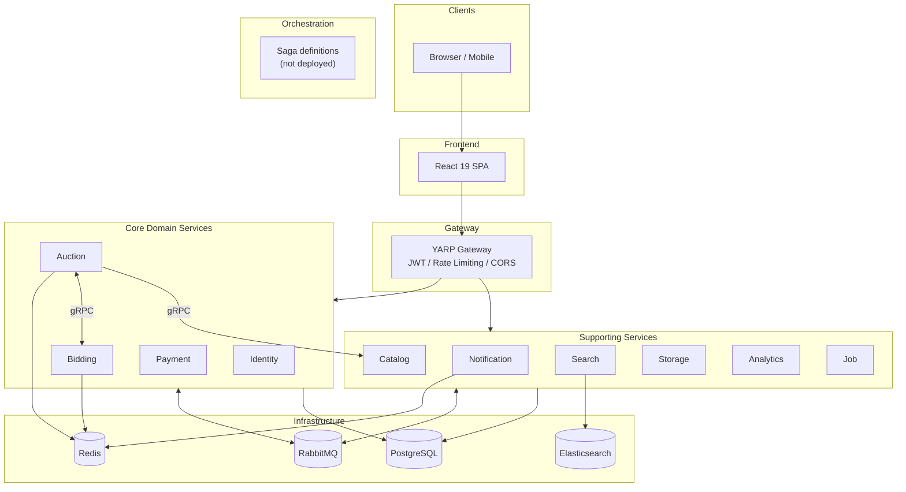
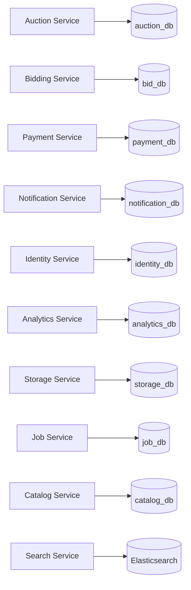
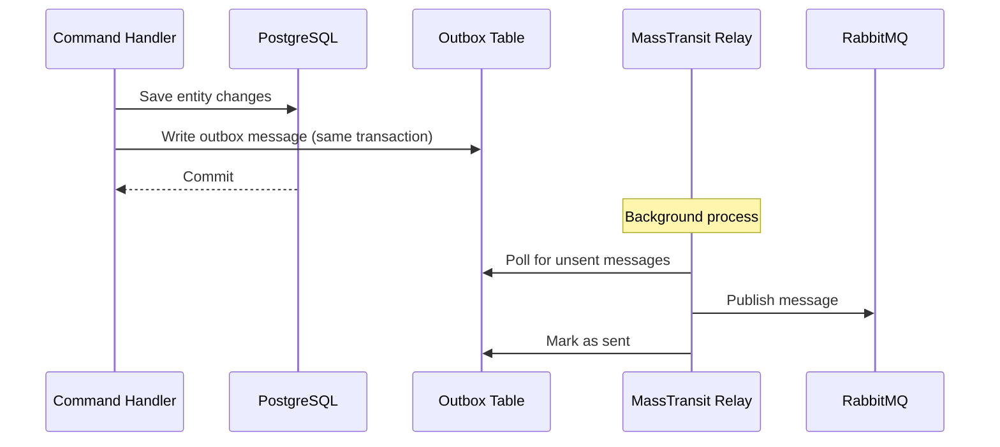
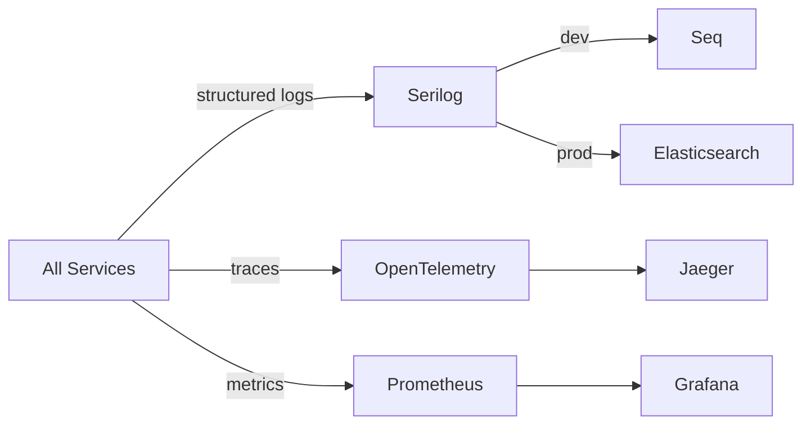

# Architecture Guide

This document explains how the auction platform is designed, how services interact, and the reasoning behind key architectural decisions. Read this before diving into any service codebase.

---

## Table of Contents

- [High-Level Architecture](#high-level-architecture)
- [Bounded Contexts](#bounded-contexts)
- [Service Responsibilities](#service-responsibilities)
- [Clean Architecture (Per Service)](#clean-architecture-per-service)
- [Data Ownership](#data-ownership)
- [Communication Patterns](#communication-patterns)
- [Auction Close Consistency](#auction-close-consistency)
- [CQRS and MediatR](#cqrs-and-mediatr)
- [Domain Events](#domain-events)
- [Saga Orchestration](#saga-orchestration)
- [Transactional Outbox](#transactional-outbox)
- [API Gateway (YARP)](#api-gateway-yarp)
- [Real-Time with SignalR](#real-time-with-signalr)
- [Resilience Patterns](#resilience-patterns)
- [Security Model](#security-model)
- [Observability Strategy](#observability-strategy)
- [Design Decisions and Trade-offs](#design-decisions-and-trade-offs)

---

## High-Level Architecture

The platform is composed of **10 microservices**, a **YARP API gateway**, a **React SPA**, and shared **BuildingBlocks** libraries. Each service is independently deployable and owns its bounded context.


```mermaid
graph TB
    subgraph Clients
        Browser["Browser / Mobile"]
    end

    subgraph Frontend
        SPA["React 19 SPA"]
    end

    subgraph Gateway
        GW["YARP Gateway<br/>JWT / Rate Limiting / CORS"]
    end

    subgraph Core["Core Domain Services"]
        IDN["Identity"]
        AUC["Auction"]
        BID["Bidding"]
        PAY["Payment"]
    end

    subgraph Supporting["Supporting Services"]
        NOT["Notification"]
        CAT["Catalog"]
        SRC["Search"]
        STR["Storage"]
        ANA["Analytics"]
        JOB["Job"]
    end

    subgraph Orchestration
        ORC["Saga definitions<br/>(not deployed)"]
    end

    subgraph Infra["Infrastructure"]
        PG[("PostgreSQL")]
        RD[("Redis")]
        RMQ[("RabbitMQ")]
        ES[("Elasticsearch")]
    end

    Browser --> SPA --> GW
    GW --> Core & Supporting
    Core & Supporting <--> RMQ
    Core & Supporting --> PG
    AUC & BID & NOT --> RD
    SRC --> ES
    AUC <-->|gRPC| BID
    AUC -->|gRPC| CAT
```

---

## Bounded Contexts

Each microservice maps to a single bounded context. Services never share databases or domain models.

| Bounded Context | Service | Core Domain Concepts |
|---|---|---|
| **Identity & Access** | Identity Service | Users, Roles, Tokens, OAuth Providers |
| **Auction Management** | Auction Service | Auctions, Bookmarks, Reviews, Media |
| **Bidding** | Bidding Service | Bids, AutoBids, Bid History, Auction Snapshots |
| **Catalog** | Catalog Service | Categories, Brands |
| **Payment & Orders** | Payment Service | Wallets, Orders, Stripe Intents, Refunds |
| **Notifications** | Notification Service | Notification Templates, Channels (Email/SMS/Push/SignalR) |
| **Search & Discovery** | Search Service | Search Index, Filters, Facets |
| **File Management** | Storage Service | Files, Upload Validation, Blob Storage |
| **Analytics** | Analytics Service | Events, Reports, Dashboards |
| **Scheduling** | Job Service | Scheduled Tasks, Auction Lifecycle Triggers |
| **Transaction Coordination** | Orchestration libraries | Saga definitions retained in source but not registered by a deployed host |

**Rules:**
- Services communicate only through messages (RabbitMQ) or synchronous queries (REST/gRPC)
- Each service defines its own contracts in `{Service}.Contracts/`
- Shared contracts (common enums, base event types) live in `src/Contracts/Common.Contracts/`

---

## Service Responsibilities

### Core Domain Services

**Identity Service** — Handles authentication and user management. Issues JWT tokens (HS256/RS256). Supports Google and Facebook OAuth. All other services validate tokens but never issue them.

**Auction Service** — The central domain service. Manages the auction lifecycle (Draft → Active → Finishing → Finished/Sold/Cancelled), bookmarks, reviews, and media. Exposes a gRPC endpoint for Bidding validation and calls Bidding during scheduled close processing to obtain the authoritative winner.

**Bidding Service** — Manages bid placement with domain rules (minimum increment, active auction, no self-bidding). Supports auto-bids (proxy bidding) and owns authoritative bid ordering. It uses a Redis request lock and a PostgreSQL advisory lock per auction; finalization takes the same advisory lock before selecting the winner. Auction snapshots provide fast validation, with Auction gRPC as the fallback when a snapshot is missing.

**Catalog Service** — Owns categories and brands. It exposes REST endpoints through the Gateway and an internal gRPC endpoint consumed by Auction.

**Payment Service** — Integrates with Stripe for payment processing and manages wallets and orders. It consumes committed auction and buy-now events idempotently to create the corresponding order records.

### Supporting Services

**Notification Service** — Multi-channel notifications (Email via SendGrid, SMS via Twilio, Push via Firebase). Hosts the SignalR hub for real-time browser updates. Uses notification templates for consistent messaging.

**Search Service** — Maintains an Elasticsearch index of auctions. Consumes domain events to keep the index in sync. Provides full-text search, filtering, and faceted navigation.

**Storage Service** — File upload and management. Validates file types and sizes. Stores files in Azure Blob Storage (production) or local filesystem (development).

**Analytics Service** — Ingests domain events for reporting. Provides dashboard data for auction performance, user activity, and revenue metrics.

**Job Service** — Owns general scheduled and operational jobs. Auction activation, ending-soon notifications, and authoritative close processing run inside Auction Service through Quartz because they mutate the Auction aggregate.

### Orchestration

The repository contains MassTransit state-machine definitions for auction
completion and buy-now flows, but no deployed application currently registers
or hosts them. The active auction-completion path publishes
`AuctionFinishedEvent` after Auction persists the final state; Payment creates
the winner order directly and the remaining consumers update their projections.
Treat the orchestration assemblies as inactive design work until a host,
persistence, start-event producer, health checks, and deployment are added.

---

## Clean Architecture (Per Service)

Every microservice follows a four-layer architecture:

```
{Service}.Domain/          # Layer 0 — Depends only on BuildingBlocks.Domain
{Service}.Application/     # Layer 1 — Domain, BuildingBlocks.Application, own contracts
{Service}.Infrastructure/  # Layer 2 — Depends on Domain + Application
{Service}.Api/             # Layer 3 — Depends on all layers (composition root)
```

### Directory and Namespace Conventions

Keep physical folders and namespaces aligned. Use singular service names for
project folders and the project's configured root namespace inside source files.
Public integration-contract namespaces are versioned APIs and must not be renamed
without a coordinated consumer migration.

Application features use vertical slices:

```text
{Service}.Application/
├── Features/
│   └── {Area}/
│       └── {Operation}/
│           ├── {Operation}Command.cs or {Operation}Query.cs
│           ├── {Operation}CommandHandler.cs or {Operation}QueryHandler.cs
│           └── {Operation}Validator.cs        # when validation is required
└── EventHandlers/                             # domain-to-integration event handlers
```

API endpoints are grouped by the same business area:

```text
{Service}.Api/
└── Endpoints/
    └── {Area}/
        └── {Area}Endpoints.cs
```

Infrastructure keeps persistence, messaging, external clients, and background
jobs separated. Message contracts use one public contract per file under
`Commands/`, `Events/`, `Enums/`, or `Grpc/`.

Tests follow the service boundary and layer under test:

```text
{Service}/
└── tests/
    ├── {Service}.Domain.Tests/
    ├── {Service}.Application.Tests/
    └── {Service}.Infrastructure.Tests/      # when infrastructure behavior is tested
```

Every service keeps Domain and Application test projects in the solution. Tests
for repository-wide dependency and folder rules remain in
`src/Tests/Architecture.Tests`.

### Public Namespace Migrations

Public contract namespaces are compatibility boundaries. Namespace
normalization must be delivered as a coordinated breaking-change migration, not
as part of an unrelated cleanup. Such a migration must:

1. inventory every producer, consumer, serializer binding, generated client,
   and external package that uses the namespace;
2. define the target namespace and versioning or compatibility strategy;
3. update producers and consumers in a coordinated release, using temporary
   adapters or dual-published contracts when rolling deployment is required;
4. verify message deserialization and client compilation across service
   boundaries; and
5. remove compatibility aliases only after all consumers have migrated.

Internal namespaces may follow folder moves when all in-repository references
are updated atomically. This does not authorize renaming public integration
contracts such as `AuctionService.Contracts`, `BidService.Contracts`, or
`JobService.Contracts`.

### Domain Layer
- Entities with private setters (encapsulation)
- Value Objects (e.g., Money, BidAmount)
- Domain Events (raised within aggregates)
- Enums representing domain concepts
- No references to infrastructure, EF Core, or external libraries

### Application Layer
- Commands and Queries (CQRS via MediatR)
- Command/Query Handlers
- DTOs and mapping
- Validation (FluentValidation)
- Pipeline behaviors (logging, validation, transaction)
- Application-level interfaces (e.g., IRepository, IEmailSender)

### Infrastructure Layer
- EF Core DbContext and entity configurations
- Repository implementations
- External service clients (Stripe, SendGrid, Twilio, etc.)
- MassTransit consumer registrations
- Redis caching implementation
- Outbox configuration

### API Layer
- Minimal API endpoint definitions using Carter
- gRPC service implementations (Auction, Bidding)
- Dependency injection configuration
- Middleware pipeline (auth, error handling, rate limiting)
- Health check registrations

---

## Data Ownership

Each service has its own PostgreSQL database. There are no cross-database joins or shared tables.


```mermaid
graph LR
    AUC["Auction Service"] --> ADB[("auction_db")]
    BID["Bidding Service"] --> BDB[("bid_db")]
    PAY["Payment Service"] --> PDB[("payment_db")]
    NOT["Notification Service"] --> NDB[("notification_db")]
    IDN["Identity Service"] --> IDB[("identity_db")]
    ANA["Analytics Service"] --> ANDB[("analytics_db")]
    STR["Storage Service"] --> SDB[("storage_db")]
    JOB["Job Service"] --> JDB[("job_db")]
    CAT["Catalog Service"] --> CDB[("catalog_db")]
    SRC["Search Service"] --> ES[("Elasticsearch")]
```

**Data consistency model:** Eventual consistency between services. When the Auction Service changes an auction's current price, the Search Service learns about it through a domain event (via RabbitMQ) and updates its Elasticsearch index asynchronously. This means search results may be slightly behind, which is an acceptable trade-off for this domain.

**Data needed across boundaries** is transferred via **event-carried state transfer**. For example, the Bidding Service maintains `AuctionSnapshot` read models that are populated from auction events. This avoids synchronous calls for every bid validation.

---

## Communication Patterns

### Synchronous

| Pattern | Use Case | Example |
|---|---|---|
| REST via Gateway | Frontend → Backend | `POST /bids`, `GET /auctions/{id}` |
| gRPC (service-to-service) | Immediate internal query/finalization | Bidding calls Auction when its snapshot is missing; Auction calls Bidding for authoritative winner selection and Catalog for catalog queries |

### Asynchronous

| Pattern | Use Case | Example |
|---|---|---|
| Domain Events (MassTransit) | Cross-service reactions | `BidPlacedEvent` → Search updates index, Notification sends alerts |
| Integration Events | Bounded context communication | `AuctionFinishedEvent` → Payment creates an order and read models update |
| Commands via Bus | Explicit workflow commands where registered | Consumers handle commands through MassTransit endpoints |

### Real-Time

| Pattern | Use Case | Example |
|---|---|---|
| SignalR WebSocket | Live updates to browser | New bid placed → push to all users watching that auction |

**Decision: Async by default.** Cross-service propagation normally goes through RabbitMQ. Synchronous gRPC is reserved for operations that need an immediate authoritative answer, including validation fallback and winner selection at the auction close boundary.

---

## Auction Close Consistency

Bid placement first takes the Redis bid lock and then executes its validation,
highest-bid read, and write while holding a PostgreSQL advisory lock derived from
the auction ID. `FinalizeAuction` takes that same database lock before reading the
highest accepted bid. This prevents bid placement and winner selection from
crossing each other at the close boundary.

The Auction Service's `CheckAuctionFinishedJob` is the single close path. It is
protected by both Quartz's non-concurrent execution attribute and the shared
Redis-backed job lock, then performs the following steps:

1. Find auctions whose end time has passed.
2. Request the authoritative winner from Bidding over internal gRPC.
3. Apply reserve-price rules and persist the final Auction aggregate.
4. Publish `AuctionFinishedEvent` through the outbox.
5. Let Payment and read-model consumers process the event idempotently.

Auto-bid lock contention raises a retryable timeout so the MassTransit consumer
can retry instead of acknowledging work that was not processed.

---

## CQRS and MediatR

Every domain service separates reads and writes:

```
Application/
├── Commands/
│   ├── PlaceBid/
│   │   ├── PlaceBidCommand.cs          # ICommand<PlaceBidResult>
│   │   ├── PlaceBidCommandHandler.cs   # ICommandHandler<PlaceBidCommand, PlaceBidResult>
│   │   └── PlaceBidCommandValidator.cs # AbstractValidator<PlaceBidCommand>
│   └── ...
├── Queries/
│   ├── GetAuctionById/
│   │   ├── GetAuctionByIdQuery.cs      # IQuery<AuctionDto>
│   │   └── GetAuctionByIdQueryHandler.cs
│   └── ...
└── DTOs/
    └── AuctionDto.cs
```

**Pipeline behaviors** (registered in DI, execute in order):
1. **LoggingBehavior** — Logs command/query execution time
2. **ValidationBehavior** — Runs FluentValidation, throws if invalid
3. **TransactionBehavior** — Wraps commands in a DB transaction

**Rules:**
- Commands mutate state and return `Result<T>` (not raw entities)
- Queries return DTOs/projections (never domain entities)
- One handler per command/query
- Validators are optional but recommended for all commands

---

## Domain Events

The platform is not event sourced. Current aggregate state is stored in each
service's database. Aggregates raise domain events, and integration events are
published through the transactional outbox after the database transaction
commits. Consumers must tolerate duplicate delivery and use versioned contracts
for compatible schema evolution.

---

## Saga Orchestration

`src/Orchestration` contains contracts and MassTransit state-machine classes for
possible future orchestration. These projects compile as libraries, but they are
not an active runtime component: there is no Orchestration API/worker,
registration, saga repository, Kubernetes Deployment, or producer for
`AuctionCompletionSagaStarted` in the current repository.

Do not depend on these sagas in production behavior. If orchestration is enabled
later, add a dedicated host and durable saga persistence, make every consumer
idempotent, define timeout/compensation behavior, and add deployment and failure
tests before switching away from the current event fan-out.

---

## Transactional Outbox

The outbox pattern guarantees that domain events are published if and only if the database transaction commits.


```mermaid
sequenceDiagram
    participant Handler as Command Handler
    participant DB as PostgreSQL
    participant Outbox as Outbox Table
    participant Relay as MassTransit Relay
    participant MQ as RabbitMQ

    Handler->>DB: Save entity changes
    Handler->>Outbox: Write outbox message (same transaction)
    DB-->>Handler: Commit

    Note over Relay: Background process
    Relay->>Outbox: Poll for unsent messages
    Relay->>MQ: Publish message
    Relay->>Outbox: Mark as sent
```

**Configured in:** Each service's Infrastructure layer via `AddMassTransit` with `.AddEntityFrameworkOutbox<TDbContext>()`.

**Why:** Without the outbox, a crash between DB commit and message publish would lose the event. The outbox ensures at-least-once delivery.

---

## API Gateway (YARP)

The YARP gateway (`src/Gateway/Gateway.Api/`) is the single entry point for all client traffic.

**Responsibilities:**
- Route matching and forwarding to upstream services
- JWT token validation (before forwarding)
- Rate limiting on write-heavy endpoints (`/bids`, `/auctions`)
- CORS enforcement
- Security headers (CSP, HSTS, X-Frame-Options)
- WebSocket upgrade for SignalR (`/hubs/**`)
- Health check aggregation

**Configuration:** Routes are defined in `appsettings.json` under the `ReverseProxy` section. Each route maps a public path pattern to an upstream service cluster.

---

## Real-Time with SignalR

The Notification Service hosts a SignalR hub for real-time browser updates.

**How it works:**
1. Frontend establishes a WebSocket connection to `/hubs/notifications` through the gateway
2. Connection is authenticated via JWT (token passed as query parameter)
3. Users are added to SignalR groups by auction ID
4. When a domain event occurs (e.g., `BidPlacedEvent`), the Notification Service pushes updates to the relevant group
5. Frontend receives the update and refreshes the UI (TanStack Query invalidation)

**Groups:**
- `auction:{auctionId}` — all users watching a specific auction
- `user:{userId}` — personal notifications for a specific user

---

## Resilience Patterns

All services use Polly for resilience:

| Pattern | Configuration | Use Case |
|---|---|---|
| Circuit Breaker | 5 failures → 30s open | External HTTP calls (Stripe, SendGrid, etc.) |
| Retry | 3 retries, exponential backoff with jitter | Transient failures |
| Timeout | Per-call timeout (configurable) | Prevent unbounded waits |
| Bulkhead | Concurrent call limits | Isolate critical paths (bid placement) |

**Configured in:** `BuildingBlocks.Infrastructure/Resilience/` and applied via named HTTP clients.

---

## Security Model

| Layer | Mechanism |
|---|---|
| Transport | HTTPS everywhere (TLS termination at Ingress) |
| Authentication | JWT tokens issued by Identity Service |
| Authorization | Role-based claims in JWT, checked at endpoint level |
| API Gateway | Token validation before forwarding, rate limiting |
| CORS | Configured allowed origins |
| Input Validation | FluentValidation on all commands |
| IDOR Protection | Ownership checks on mutation endpoints (wallet, notifications) |
| Security Headers | CSP, HSTS, X-Content-Type-Options, X-Frame-Options |
| Secrets | Kubernetes ExternalSecrets in production |

---

## Observability Strategy


```mermaid
graph LR
    Services["All Services"] -->|structured logs| Serilog
    Serilog -->|dev| SEQ["Seq"]
    Serilog -->|prod| ELK["Elasticsearch"]
    Services -->|traces| OTEL["OpenTelemetry"]
    OTEL --> Jaeger
    Services -->|metrics| PROM["Prometheus"]
    PROM --> Grafana
```

**Four golden signals monitored:**
1. **Latency** — request duration (p50, p95, p99)
2. **Traffic** — requests per second
3. **Errors** — error rate by status code
4. **Saturation** — CPU, memory, connection pool usage

**Correlation IDs** are propagated through all log entries and traces, allowing end-to-end request tracking across services.

---

## Design Decisions and Trade-offs

| Decision | Rationale | Trade-off |
|---|---|---|
| Database-per-service | Strong isolation, independent scaling | No cross-service joins; eventual consistency |
| Async messaging by default | Loose coupling, resilience to downstream failures | Eventual consistency; harder debugging |
| gRPC for Auction ↔ Bidding | Immediate validation fallback and an authoritative close boundary | Auction close waits for Bidding availability; retries and health monitoring are required |
| MassTransit Outbox | Guarantees event delivery after DB commit | Slightly higher write latency; outbox table management |
| YARP over Ocelot | Better performance, first-party Microsoft support | Less community middleware than Ocelot |
| Carter for Minimal APIs | Clean endpoint organization without controllers | Less familiar to developers used to controllers |
| Direct event fan-out for auction completion | Matches the currently deployed consumers and keeps the first release simpler | Cross-service progress is eventually consistent; inactive saga definitions must not be mistaken for runtime behavior |
| Redis for caching + locking | Fast in-memory cache, built-in distributed lock support | Additional infrastructure dependency |
| Elasticsearch for search | Purpose-built for full-text search and facets | Separate data sync pipeline; eventual consistency |
