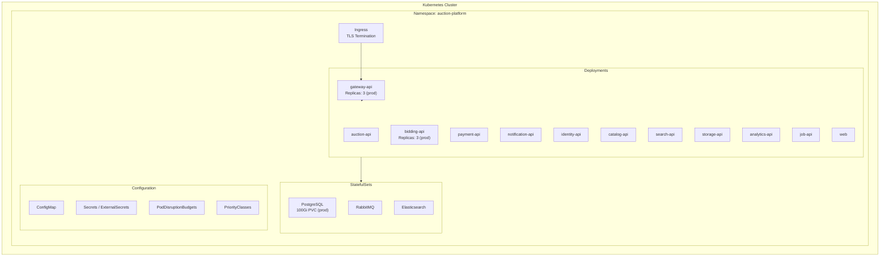
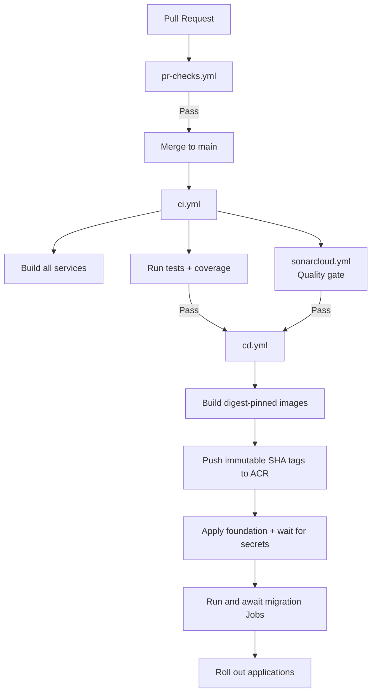

# Deployment Guide

This document covers how the auction platform is deployed across local development, staging, and production environments.

---

## Table of Contents

- [Deployment Environments](#deployment-environments)
- [Docker Compose (Local Development)](#docker-compose-local-development)
- [Container Images](#container-images)
- [Kubernetes Architecture](#kubernetes-architecture)
- [Kustomize Structure](#kustomize-structure)
- [Deploying to Kubernetes](#deploying-to-kubernetes)
- [Production Configuration](#production-configuration)
- [CI/CD Pipeline](#cicd-pipeline)
- [Secrets Management](#secrets-management)
- [Scaling Strategy](#scaling-strategy)
- [Database Management](#database-management)
- [Monitoring and Alerting](#monitoring-and-alerting)
- [Rollback Procedures](#rollback-procedures)

---

## Deployment Environments

| Environment | Infrastructure | Purpose |
|---|---|---|
| **Local** | Docker Compose | Developer workstation, full stack |
| **Dev** | Kubernetes (dev overlay) | Shared development, integration testing |
| **Staging** | Kubernetes (staging overlay) | Pre-production validation |
| **Production** | Kubernetes (production overlay) | Live traffic |

---

## Docker Compose (Local Development)

The `deploy/docker/docker-compose.yml` file defines the complete local stack.

### Infrastructure Services

| Service | Image | Ports | Volumes |
|---|---|---|---|
| PostgreSQL 16 | `postgres:16-alpine` | 5432 | `postgres_data` |
| Redis 7 | `redis:7-alpine` | 6379 | `redis_data` |
| RabbitMQ 3.13 | `rabbitmq:3.13-management-alpine` | 5672, 15672 | `rabbitmq_data` |
| Elasticsearch 8 | `elasticsearch:8.11.3` | 9200, 9300 | `elasticsearch_data` |
| Seq | `datalust/seq:latest` | 5341 | `seq_data` |

### Database Initialization

The `deploy/docker/scripts/init-databases.sh` script runs on first PostgreSQL startup. It creates per-service databases:
- `auction_db`, `bid_db`, `payment_db`, `notification_db`
- `identity_db`, `analytics_db`, `storage_db`, `job_db`, `catalog_db`

### Commands

```bash
# Full stack
docker compose -f deploy/docker/docker-compose.yml up -d

# Infrastructure only
docker compose -f deploy/docker/docker-compose.yml up -d postgres redis rabbitmq elasticsearch seq

# Rebuild a specific service
docker compose -f deploy/docker/docker-compose.yml build auction-api
docker compose -f deploy/docker/docker-compose.yml up -d auction-api

# View logs
docker compose -f deploy/docker/docker-compose.yml logs -f auction-api

# Tear down (preserve data)
docker compose -f deploy/docker/docker-compose.yml down

# Tear down (reset everything)
docker compose -f deploy/docker/docker-compose.yml down -v
```

---

## Container Images

Each service has a Dockerfile in its API project directory. All Dockerfiles use a multi-stage build:

```
Stage 1: SDK image → restore, build, publish
Stage 2: ASP.NET runtime image → copy published output, run
```

Runtime images run as non-root users. Base images are pinned by digest, publish
framework-dependent artifacts for the target architecture, and receive OCI
version/revision labels from the CD workflow. The web image serves the Vite
bundle from Nginx on port `8080` as UID `101`.

### Image Registry

Production images are published to the Azure Container Registry configured by
the `ACR_LOGIN_SERVER` GitHub variable:

```
<acr>.azurecr.io/auction-platform/auction-api:<12-char-git-sha>
<acr>.azurecr.io/auction-platform/bidding-api:<12-char-git-sha>
<acr>.azurecr.io/auction-platform/catalog-api:<12-char-git-sha>
<acr>.azurecr.io/auction-platform/gateway-api:<12-char-git-sha>
<acr>.azurecr.io/auction-platform/web:<12-char-git-sha>
```

The same immutable tag format is used for Identity, Payment, Notification,
Analytics, Search, Storage, and Job images.

### Building Images Locally

```bash
# Build a single service
docker build -t auction-api:local -f src/Services/Auction/Auction.Api/Dockerfile .

# Build all services
docker compose -f deploy/docker/docker-compose.yml build
```

---

## Kubernetes Architecture

The Kubernetes deployment uses Kustomize for environment-specific configuration.


```mermaid
graph TB
    subgraph Cluster["Kubernetes Cluster"]
        subgraph NS["Namespace: auction-platform"]
            ING["Ingress<br/>TLS Termination"]

            subgraph Deployments["Deployments"]
                GW["gateway-api<br/>Replicas: 3 (prod)"]
                AUC["auction-api"]
                BID["bidding-api<br/>Replicas: 3 (prod)"]
                PAY["payment-api"]
                NOT["notification-api"]
                IDN["identity-api"]
                CAT["catalog-api"]
                SRC["search-api"]
                STR["storage-api"]
                ANA["analytics-api"]
                JOB["job-api"]
                WEB["web"]
            end

            subgraph StatefulSets["StatefulSets"]
                PG["PostgreSQL<br/>100Gi PVC (prod)"]
                RMQ["RabbitMQ"]
                ES["Elasticsearch"]
            end

            subgraph Config["Configuration"]
                CM["ConfigMap"]
                SEC["Secrets / ExternalSecrets"]
                PDB["PodDisruptionBudgets"]
                PC["PriorityClasses"]
            end

        end
    end

    ING --> GW
    GW --> Deployments
    Deployments --> StatefulSets
```

---

## Kustomize Structure

```
deploy/kubernetes/
├── base/                              # Shared base manifests
│   ├── kustomization.yaml             # Resource list, labels
│   ├── namespace.yaml                 # auction-platform namespace
│   ├── configmap.yaml                 # Shared config (connection strings, etc.)
│   ├── secrets.yaml                   # Base secrets (overridden per env)
│   ├── ingress.yaml                   # Ingress with TLS
│   ├── priority-classes.yaml          # Pod priority classes
│   ├── rbac.yaml                      # ServiceAccounts, Roles, RoleBindings
│   ├── services/
│   │   ├── auction-api.yaml           # Deployment + Service + HPA
│   │   ├── bidding-api.yaml
│   │   ├── payment-api.yaml
│   │   ├── notification-api.yaml
│   │   ├── identity-api.yaml
│   │   ├── catalog-api.yaml
│   │   ├── analytics-api.yaml
│   │   ├── search-api.yaml
│   │   ├── storage-api.yaml
│   │   ├── job-api.yaml
│   │   ├── gateway-api.yaml
│   │   ├── web.yaml
│   │   └── pdb.yaml                   # PodDisruptionBudgets for all services
│   ├── migrations.yaml                # One-shot EF Core migration Jobs
│   ├── infrastructure/
│   │   ├── postgres.yaml              # StatefulSet + PVC
│   │   ├── redis.yaml                 # Deployment
│   │   ├── rabbitmq.yaml              # StatefulSet
│   │   └── elasticsearch.yaml         # StatefulSet
│
└── overlays/
    ├── dev/
    │   └── kustomization.yaml         # Minimal resources, debug logging
    ├── staging/
    │   └── kustomization.yaml         # Moderate resources, staging config
    └── production/
        ├── kustomization.yaml         # ACR images, production replicas and patches
        └── external-secrets.yaml      # ExternalSecrets for credential management
```

---

## Deploying to Kubernetes

### Prerequisites

- `kubectl` configured with cluster access
- Kustomize (built into kubectl v1.14+)
- Container images pushed to the configured Azure Container Registry

### Deploy to Development

```bash
kubectl apply -k deploy/kubernetes/overlays/dev
```

### Deploy to Staging

```bash
kubectl apply -k deploy/kubernetes/overlays/staging
```

### Deploy to Production

Use the manually approved **Azure CD** workflow described in
[`deploy/azure/README.md`](../deploy/azure/README.md). Do not deploy production
with one undifferentiated `kubectl apply -k`: application Deployments must not
roll out until the migration Jobs have completed.

For inspection only, render the production overlay locally:

```bash
kubectl kustomize deploy/kubernetes/overlays/production > /tmp/auction-production.yaml
```

### Verify Deployment

```bash
# Check all pods
kubectl get pods -n auction-platform

# Check services
kubectl get svc -n auction-platform

# Check pod logs
kubectl logs -n auction-platform deployment/auction-api -f

# Check pod health
kubectl describe pod -n auction-platform <pod-name>
```

---

## Production Configuration

Production defaults live in each service's tracked
`appsettings.Production.json`. Shared Kubernetes values are supplied by
`deploy/kubernetes/base/configmap.yaml`, while secrets come from the production
ExternalSecret and Azure Key Vault.

### Logging
- Minimum level: **Warning** (not Debug/Information)
- Sinks: **Console** + **Elasticsearch** (Seq disabled)
- JSON format with service name enrichment

### Network
- HTTP on port **8080** (internal)
- gRPC on port **8081** (internal, for Auction ↔ Bidding)
- TLS terminated at Ingress level

### Observability
- OpenTelemetry traces exported to configurable OTLP endpoint
- Console exporter disabled

### Resources (Production Overlay)

| Resource | Requests | Limits |
|---|---|---|
| Backend services | 200m CPU, 512Mi memory | 1000m CPU, 1Gi memory |
| PostgreSQL | — | 2Gi–4Gi memory |
| Gateway, Bidding | 3 replicas | — |
| PostgreSQL storage | — | 100Gi PVC |

---

## CI/CD Pipeline

### Pipeline Flow


```mermaid
graph TD
    PR["Pull Request"] --> PRC["pr-checks.yml"]
    PRC --> |Pass| Merge["Merge to main"]
    Merge --> CI["ci.yml"]
    CI --> Build["Build all services"]
    CI --> Test["Run tests + coverage"]
    CI --> SONAR["sonarcloud.yml<br/>Quality gate"]
    Test --> |Pass| CD["cd.yml"]
    SONAR --> |Pass| CD
    CD --> Docker["Build digest-pinned images"]
    Docker --> Push["Push immutable SHA tags to ACR"]
    Push --> Foundation["Apply foundation + wait for secrets"]
    Foundation --> Migrate["Run and await migration Jobs"]
    Migrate --> Deploy["Roll out applications"]
```

### Workflow Details

**pr-checks.yml** (Pull Request)
- Triggered on: Pull request to main
- Steps: Restore, build, run tests, lint frontend
- Must pass before merge is allowed

**ci.yml** (Continuous Integration)
- Triggered on: Push to main
- Steps: Build all projects, run all tests, collect code coverage
- Uploads coverage reports for SonarCloud

**sonarcloud.yml** (Code Quality)
- Triggered by: CI pipeline
- Steps: Run SonarCloud analysis, enforce quality gate
- Configuration: `sonar-project.properties`
- Quality gate timeout: 300 seconds

**cd.yml** (Continuous Deployment)
- Builds images after successful CI and supports a manually approved production deployment
- Pushes all service and web images to ACR with immutable 12-character commit SHA tags
- Applies foundation resources, waits for External Secrets, runs migration Jobs, and only then rolls out Deployments
- Adds OCI image version and revision metadata during the build

**scheduled.yml** (Security)
- Triggered on: Cron schedule
- Steps: Dependency vulnerability scanning

---

## Secrets Management

### Local Development
- Environment variables in `.env` file
- Docker Compose injects them into containers

### Kubernetes Dev/Staging
- Kubernetes Secrets in `base/secrets.yaml`
- Overridden per environment in overlay

### Kubernetes Production
- **ExternalSecrets** (`production/external-secrets.yaml`)
- Credentials stored in Azure Key Vault
- ExternalSecrets operator syncs them into Kubernetes Secrets

### Required Secrets

| Secret | Used By |
|---|---|
| PostgreSQL credentials | All database-backed services |
| Redis password | Auction, Bidding, Notification |
| RabbitMQ credentials | All services |
| JWT signing key | Identity, Gateway |
| Stripe keys | Payment |
| SendGrid API key | Notification |
| Twilio credentials | Notification |
| Firebase service account | Notification |
| OAuth client credentials | Identity |
| Elasticsearch credentials | Search, Logging |

---

## Scaling Strategy

### Horizontal Scaling

| Service | Default Replicas | Scaling Trigger |
|---|---|---|
| Gateway | 3 | CPU > 70%, request rate |
| Bidding | 3 | CPU > 70%, bid volume |
| Auction | 1 | CPU > 70% |
| Payment | 1 | CPU > 70% |
| Notification | 1 | Queue depth |
| Others | 1 | CPU > 70% |

Gateway and Bidding get 3 replicas by default because:
- Gateway handles all inbound traffic
- Bidding is the most latency-sensitive path (real-time auctions)

### Vertical Scaling

Increase resource limits in the Kustomize overlay:

```yaml
patches:
  - target:
      kind: Deployment
      name: bidding-api
    patch: |
      - op: replace
        path: /spec/template/spec/containers/0/resources/limits/memory
        value: "2Gi"
```

### Database Scaling

PostgreSQL is a StatefulSet with persistent storage. For production:
- Consider managed PostgreSQL (Azure Database for PostgreSQL, AWS RDS)
- Read replicas for query-heavy services
- Connection pooling with PgBouncer

---

## Database Management

### Migrations

EF Core migrations are applied automatically on service startup in development.
Production uses the one-shot Jobs in `deploy/kubernetes/base/migrations.yaml`.
The CD workflow deletes completed migration Jobs from the preceding deployment,
applies the newly rendered Jobs, and waits for every Job to complete before
applying application Deployments. A failed or timed-out migration stops the
rollout.

For local migration work:

```bash
# Apply migrations locally
cd src/Services/Auction/Auction.Infrastructure
dotnet ef database update --startup-project ../Auction.Api

# Create a new migration
dotnet ef migrations add MigrationName --startup-project ../Auction.Api
```

### Backups

For production PostgreSQL:
- Automated daily backups via pg_dump or managed service backups
- Point-in-time recovery enabled
- Test restore procedure regularly

---

## Monitoring and Alerting

### Health Checks

Every service exposes:
- `/health` — overall health
- `/health/ready` — readiness (Kubernetes readiness probe)
- `/health/live` — liveness (Kubernetes liveness probe)

### Metrics

The services expose application metrics through their observability setup, but
the production overlay does not currently install Prometheus Operator
`ServiceMonitor` resources. Connect these endpoints to the chosen managed
monitoring backend before relying on the alert examples below.

### Logging

| Environment | Log Sink | Access |
|---|---|---|
| Local | Seq | http://localhost:5341 |
| Production | Elasticsearch-compatible endpoint | Deployment-specific dashboard |

### Tracing

OpenTelemetry traces are exported through the configured OTLP endpoint. The
production overlay does not install Jaeger; configure a managed collector or
observability backend explicitly.

### Recommended Alerts

| Alert | Condition | Severity |
|---|---|---|
| Service down | Pod restarts > 3 in 5 min | Critical |
| High latency | p99 > 500ms for 5 min | Warning |
| Error rate | 5xx rate > 1% for 5 min | Critical |
| Queue depth | RabbitMQ queue > 10k messages | Warning |
| Disk usage | PostgreSQL PVC > 80% | Warning |
| Memory | Pod memory > 90% limit | Warning |

---

## Rollback Procedures

### Rolling Back a Deployment

```bash
# Check rollout history
kubectl rollout history deployment/auction-api -n auction-platform

# Rollback to previous revision
kubectl rollout undo deployment/auction-api -n auction-platform

# Rollback to a specific revision
kubectl rollout undo deployment/auction-api -n auction-platform --to-revision=3
```

### Rolling Back a Database Migration

EF Core does not have automatic rollback in production. Options:
1. Apply a new migration that reverses the changes
2. Restore from backup (if destructive migration)
3. Use `dotnet ef database update PreviousMigrationName` to revert

### Emergency Procedures

1. **Scale to zero:** `kubectl scale deployment/auction-api --replicas=0 -n auction-platform`
2. **Check logs:** `kubectl logs -n auction-platform deployment/auction-api --previous`
3. **Rollback:** `kubectl rollout undo deployment/auction-api -n auction-platform`
4. **Verify:** `kubectl get pods -n auction-platform -w`
