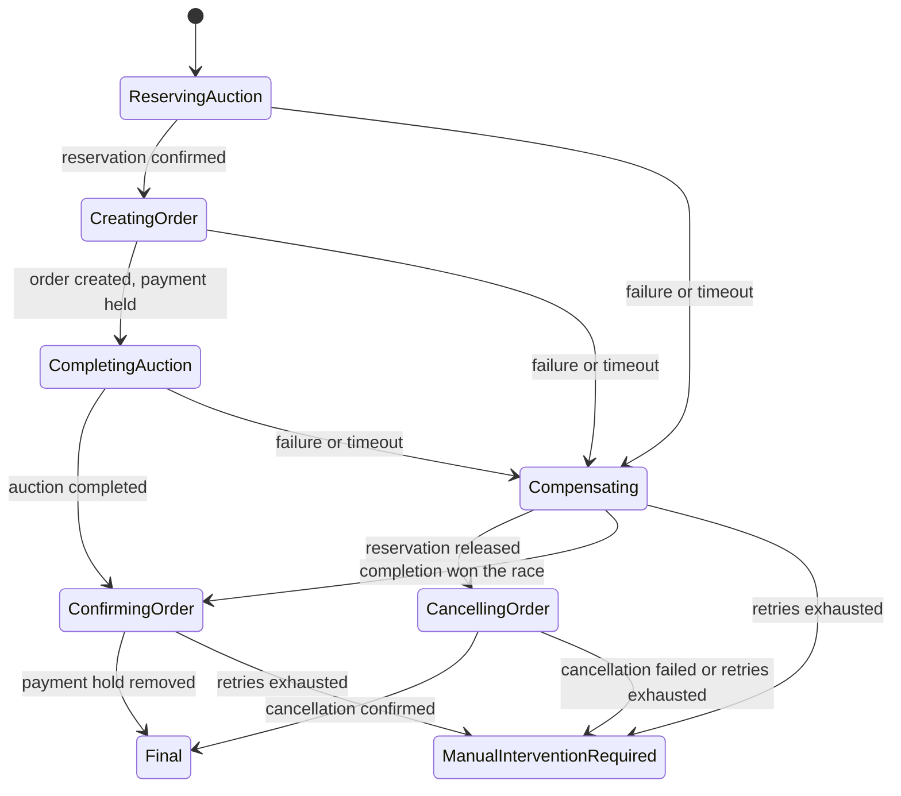

# Auction workflow orchestration

`Orchestration.Api` hosts the Buy Now and auction-completion state machines. PostgreSQL stores saga state, deadlines, recovery cases, and the transactional outbox; RabbitMQ carries participant commands and acknowledgements. Auction, Payment, and Notification register the participant consumers.

## Buy Now



The authenticated Buy Now endpoint atomically reserves the auction, records a purchase receipt, and queues `BuyNowSagaStarted`. It returns **202 Accepted** with a correlation ID and `Processing` status. An optional UUID `Idempotency-Key` reuses an attempt; repeated requests by the current reservation owner also return that receipt. `GET /api/v1/auctions/{auctionId}/purchase` returns the authenticated buyer's latest receipt (or JSON null). The browser polls it and redirects to orders after `Completed`; `NeedsReview` identifies an unresolved recovery case.

- Reservations persist the correlation and buyer IDs. Completion also records the order ID, making duplicate completion idempotent.
- Release records a cancellation fence even if it arrives before reserve. An older release cannot release a newer reservation. Retain these fences while delayed or dead-lettered commands can be replayed.
- Completion and release compete through optimistic concurrency and the consumer outbox. If completion won, release acknowledges the completed sale instead of reopening it.
- Rollback releases/fences auction work before cancelling the order. Payment serializes create/cancel commands by auction and persists cancelled attempts, preventing delayed creation after cancellation.
- Saga-created orders remain unavailable for payment until `ConfirmBuyNowOrder` activates them. The saga waits for `BuyNowOrderConfirmed` before reporting success. Cancelled orders do not block a later purchase.
- Final saga rows remain as replay tombstones. Replaying a start cannot reopen a completed workflow.

## Auction completion

The authoritative close handler atomically publishes `AuctionCompletionSagaStarted` for a sold, ordinary auction. Payment creates the winner order idempotently and validates an existing order against the winner, seller, and amount. An unknown or failed order outcome retains the saga for forward recovery; it does not reopen the sold auction.

Notification creates buyer and seller in-app notifications and acknowledges persistence. Stable per-order/per-recipient references prevent duplicate persisted notifications. This acknowledgement does not guarantee delivery to an offline browser or an external email/SMS channel. Notification failure preserves the successful sale and order, and records a retryable notification recovery case.

Public sale events still update projections and analytics. `OrderCreationManaged` prevents the legacy Payment consumers from also creating orders; old unmanaged events remain supported.

## Storage, deadlines, and recovery

Both state machines use PostgreSQL optimistic concurrency and a transactional consumer outbox. A worker claims overdue rows with `FOR UPDATE SKIP LOCKED`, clears their due date, and queues timeout messages in the same transaction. Generation tokens reject stale timeouts. Deadlines survive restarts and multiple host replicas; RabbitMQ's delayed-message plugin is not required by the orchestration host.

Acknowledgement retries are bounded. Exhaustion retains `ManualInterventionRequired` and publishes a durable recovery case. Inspect the case, retained saga, auction ownership, Payment order/cancellation attempt, and transport error queues before retrying. Retry the existing correlation ID; do not delete cancellation fences or reopen completed auctions.

The host exposes Admin-only operations:

- `GET /api/v1/orchestration/recovery/`: unresolved cases (up to 100).
- `POST /api/v1/orchestration/recovery/{workflow}/{correlationId}/{step}/retry`: retry the recorded step. Use the workflow and step values returned by GET. Retry actor, time, and count are persisted atomically with the command.

The admin API is internal, with no public gateway route. Compose exposes port 5012; Kubernetes operators can port-forward the service. Supply an Admin bearer token. Health endpoints are `/health/live` and `/health/ready`.

## Deployment

Compose, Kubernetes overlays, Azure database/secret provisioning, image build matrices, and the solution include the host. Apply Auction `BuyNowReservationOwnership` and `BuyNowPurchaseTracking`, Payment `BuyNowOrderCompensation`, and Orchestration `InitialOrchestration` migrations before serving traffic with the new code. Deploy the participant services and orchestration host together; the new Auction entry points depend on the host.

Provide `ConnectionStrings__DefaultConnection` for `orchestration_db`, RabbitMQ settings, and the same Identity issuer/signing configuration as the other APIs. Existing PostgreSQL volumes need the new database provisioned explicitly: initialization scripts only run for fresh volumes. Production migrations use the existing migration-job mechanism; `dotnet Orchestration.Api.dll --migrate-only` applies only the orchestration schema. Automatic startup migration defaults off in production.

No shared environment is migrated or deployed by these source changes. Local verification uses disposable databases and a broker.

## Tests

```sh
dotnet test src/Orchestration/tests/Orchestration.Sagas.Tests
# Use disposable PostgreSQL and RabbitMQ servers; tests create/drop databases.
export BACKEND_TEST_POSTGRES='Host=localhost;Port=5432;Database=postgres;Username=postgres;Password=YOUR_TEST_PASSWORD'
export BACKEND_TEST_RABBIT_PORT=5672
dotnet test src/Orchestration/tests/Orchestration.Infrastructure.Tests
```

The broker suite runs real saga/participant registrations and database migrations, restarts the saga host during order creation, recovers a persisted overdue deadline, and verifies both sale flows. It substitutes notification delivery with database persistence. Additional Auction, Payment, and Notification tests cover ownership, cancellation ordering, concurrent completion/release, payment holds, and replay. Run broker tests against an isolated RabbitMQ instance because they use the production queue names.
